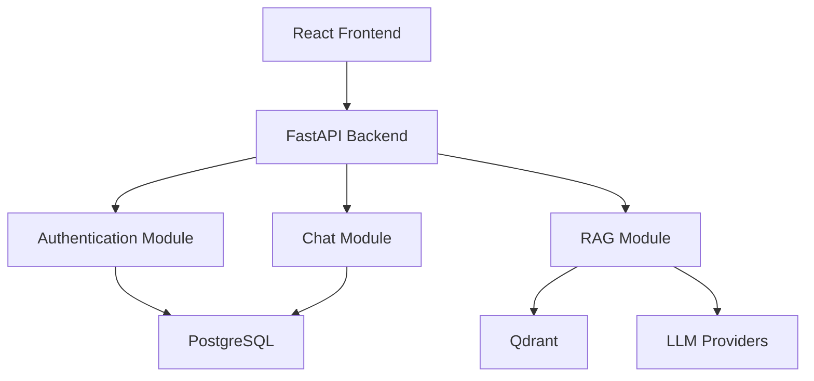
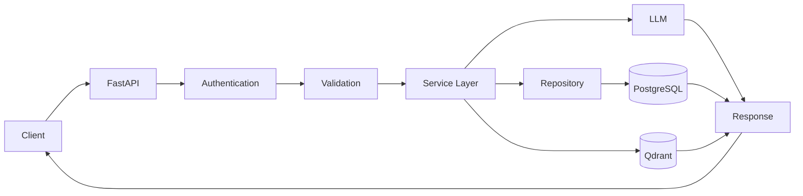

# Technical Requirements Document (TRD)

**Project:** MedIntel AI

**Document ID:** TRD-001

**Version:** v1.0 

**Status:** Frozen

**Owner:** Subhranshu Panda

**Repository:** medintel-ai

**Related Documents:**
- 00_PROJECT_SCOPE.md
- 01_PRD.md

**Next Document:**
- 03_APP_FLOW.md

**Last Updated:** July 2026

---

# Table of Contents

1. Technical Overview
2. Technical Objectives
3. System Scope
4. High-Level Architecture
5. Architecture Principles
6. Design Constraints
7. Technical Assumptions
8. Architecture Decisions
9. Technology Evaluation Summary

---




# 1. Technical Overview

## Purpose

This Technical Requirements Document (TRD) defines the overall technical architecture, engineering standards, implementation strategy, and technology decisions for the MedIntel AI platform.

The document serves as the primary engineering reference for designing, implementing, testing, deploying, and maintaining the system throughout its lifecycle.

While the Product Requirements Document (PRD) specifies **what** the product should accomplish, this document specifies **how** those requirements will be implemented using modern software engineering principles.

---

## Objectives

The technical objectives of MedIntel AI are to:

- Develop a modular and scalable software architecture.
- Implement a production-ready Retrieval-Augmented Generation (RAG) pipeline.
- Ensure secure authentication and authorization.
- Support multiple Large Language Model (LLM) providers through an abstraction layer.
- Maintain a clean separation of concerns across frontend, backend, AI services, and infrastructure.
- Enable reproducible deployments using containerization.
- Provide a maintainable codebase with comprehensive documentation and automated testing.

---

## Audience

This document is intended for:

- Software Engineers
- AI/ML Engineers
- Backend Developers
- Frontend Developers
- DevOps Engineers
- Future Contributors
- Technical Reviewers

---

# 2. Technical Objectives

The system shall be designed with the following engineering goals.

## Scalability

The architecture shall support horizontal scaling for API services and AI workloads without requiring significant architectural changes.

---

## Maintainability

The project shall follow a modular architecture with clear separation between business logic, infrastructure, and presentation layers to simplify long-term maintenance.

---

## Reliability

The platform shall provide consistent behavior through robust error handling, structured logging, health monitoring, and automated testing.

---

## Performance

The application shall deliver responsive user experiences while minimizing inference latency, retrieval time, and API response times.

---

## Security

Security shall be integrated into every layer of the application through authentication, authorization, encryption, secure secret management, and audit logging.

---

## Extensibility

The architecture shall support future enhancements—including new AI models, additional retrieval pipelines, and external integrations—without requiring major refactoring.

---

# 3. System Scope

## In Scope

Version 1.0 will include:

- Modern web frontend
- RESTful backend API
- Authentication and authorization
- AI chatbot interface
- Retrieval-Augmented Generation (RAG)
- Vector database integration
- Medical document ingestion
- Semantic search
- Conversation history
- Citation generation
- Administrative dashboard
- Monitoring and logging
- Dockerized deployment
- CI/CD pipeline

---

## Out of Scope

The following capabilities are intentionally excluded from Version 1:

- Native mobile applications
- Electronic Medical Record (EMR) integration
- Clinical diagnosis
- Prescription generation
- Medical image interpretation
- Multi-region deployment
- Offline mode
- Voice assistant
- Federated learning

These features may be considered in future releases.

---

# 4. High-Level Architecture

The MedIntel AI platform follows a layered, service-oriented architecture.

```text
                        ┌─────────────────────┐
                        │     React Client    │
                        └──────────┬──────────┘
                                   │
                            HTTPS / REST API
                                   │
                        ┌──────────▼──────────┐
                        │     FastAPI API     │
                        └──────────┬──────────┘
                                   │
        ┌───────────────┬──────────┼──────────┬───────────────┐
        │               │          │          │               │
 Authentication   AI Service   RAG Engine   Database   Admin Service
        │               │          │          │               │
        └───────────────┴──────────┼──────────┴───────────────┘
                                   │
                          Vector Database
                                   │
                          Medical Knowledge
                                Repository
```

### Architectural Layers

**Presentation Layer**
- React frontend
- Responsive UI
- Dashboard
- Chat interface

**Application Layer**
- FastAPI
- Business logic
- Authentication
- API routing

**AI Layer**
- Prompt orchestration
- Retrieval pipeline
- LLM interaction
- Response generation

**Data Layer**
- PostgreSQL
- Vector database
- Object storage
- Metadata management

**Infrastructure Layer**
- Docker
- GitHub Actions
- Reverse proxy
- Cloud deployment
- Monitoring

---

# 5. Architecture Principles

The architecture is guided by the following principles.

## API-First Design

All application functionality shall be exposed through well-documented REST APIs.

---

## Modular Design

Each subsystem shall be independently maintainable and replaceable.

---

## Separation of Concerns

Business logic, infrastructure, presentation, and AI services shall remain isolated.

---

## Explainability by Design

AI-generated responses shall be grounded in retrieved medical evidence and accompanied by citations whenever possible.

---

## Security by Default

Authentication, authorization, input validation, encryption, and logging shall be enabled by default.

---

## Documentation-First Development

Every major implementation shall reference the corresponding documentation before development begins.

---

# 6. Design Constraints

The project is subject to the following constraints:

- Solo developer implementation.
- Budget-conscious cloud infrastructure.
- Dependence on external AI APIs.
- Publicly available medical datasets.
- Educational and portfolio-focused objectives.
- Open-source technology stack where practical.

---

# 7. Technical Assumptions

The architecture assumes:

- Docker is available for local development.
- PostgreSQL will serve as the primary relational database.
- A vector database (Qdrant or ChromaDB) will store embeddings.
- AI providers expose reliable APIs.
- HTTPS is available in production.
- GitHub Actions will manage CI/CD workflows.

---

# 8. Architecture Decisions (Summary)

| ADR | Decision | Status |
|------|----------|--------|
| ADR-001 | FastAPI selected as backend framework | Accepted |
| ADR-002 | React + TypeScript selected for frontend | Accepted |
| ADR-003 | PostgreSQL selected as primary database | Accepted |
| ADR-004 | Retrieval-Augmented Generation (RAG) architecture | Accepted |
| ADR-005 | Docker-based deployment | Accepted |
| ADR-006 | GitHub Actions for CI/CD | Accepted |
| ADR-007 | Modular monolith architecture for Version 1 | Accepted |

Detailed Architecture Decision Records (ADRs) will be maintained separately under `docs/architecture/adr/`.

---

# 9. Technology Evaluation Summary

The following technology selections were made after evaluating maintainability, ecosystem maturity, performance, scalability, and developer productivity.

## Technology Decision Matrix

| Category | Selected Technology | Primary Reason | Alternatives Evaluated |
|-----------|---------------------|----------------|------------------------|
| Frontend | React + TypeScript | Mature ecosystem and strong typing | Next.js, Vue.js |
| Backend | FastAPI | High performance, async support, automatic OpenAPI | Django, Flask |
| Database | PostgreSQL | ACID compliance, reliability, extensibility | MySQL, SQLite |
| Vector Database | Qdrant | Fast vector search and metadata filtering | ChromaDB, Pinecone |
| AI Framework | LangChain + LangGraph | Mature orchestration and workflow capabilities | LlamaIndex |
| Deployment | Docker | Environment consistency and portability | Podman |
| CI/CD | GitHub Actions | Native GitHub integration | GitLab CI, Jenkins |
---

**End of Part 1**


---

# 10. Technology Stack

The MedIntel AI platform adopts a modern, modular, and production-oriented technology stack. Every technology has been selected based on performance, maintainability, community support, and long-term scalability.

---

## 10.1 Frontend

| Category | Technology | Purpose |
|----------|------------|---------|
| Framework | React 19 + TypeScript | Single Page Application |
| Build Tool | Vite | Fast development and optimized builds |
| Styling | Tailwind CSS | Utility-first responsive styling |
| UI Components | shadcn/ui | Accessible and reusable UI components |
| Icons | Lucide React | Consistent icon library |
| State Management | Zustand | Lightweight global state management |
| Forms | React Hook Form + Zod | Form handling and validation |
| Charts | Recharts | Analytics and dashboard visualizations |
| HTTP Client | Axios | API communication |
| Routing | React Router | Client-side routing |

### Selection Rationale

React provides a mature ecosystem, excellent community support, and strong TypeScript integration. Combined with Vite and Tailwind CSS, it enables rapid development while maintaining high performance and maintainability.

### Alternatives Considered

- Next.js
- Vue.js
- Angular

**Decision:** React + TypeScript provides the best balance between simplicity, flexibility, and portfolio relevance.

---

## 10.2 Backend

| Category | Technology | Purpose |
|----------|------------|---------|
| Framework | FastAPI | REST API |
| Language | Python 3.12+ | Backend & AI development |
| Validation | Pydantic v2 | Data validation |
| Authentication | JWT + OAuth2 | Secure authentication |
| ORM | SQLAlchemy 2.0 | Database abstraction |
| Database Migration | Alembic | Schema versioning |
| Background Jobs | Celery (Future) | Asynchronous processing |

### Selection Rationale

FastAPI offers excellent performance, automatic OpenAPI documentation, asynchronous support, and strong type safety, making it ideal for AI-driven APIs.

### Alternatives Considered

- Django
- Flask
- Express.js

**Decision:** FastAPI aligns best with modern Python AI ecosystems.

---

## 10.3 Artificial Intelligence Stack

| Category | Technology | Purpose |
|----------|------------|---------|
| LLM Framework | LangChain | AI orchestration |
| Workflow Engine | LangGraph | Stateful AI workflows |
| Embeddings | OpenAI / BAAI BGE | Semantic embeddings |
| LLM Providers | OpenAI, Anthropic, Gemini | Response generation |
| Prompt Management | LangChain Templates | Prompt engineering |
| Tokenization | tiktoken | Token estimation |
| Evaluation | Ragas (Future) | RAG evaluation |

### Selection Rationale

The AI layer is designed with provider abstraction, enabling multiple LLM providers without significant architectural changes.

---

## 10.4 Retrieval-Augmented Generation (RAG)

| Component | Technology |
|------------|-----------|
| Vector Database | Qdrant (Preferred) |
| Alternative Vector Store | ChromaDB |
| Chunking | Recursive Character Text Splitter |
| Retrieval | Hybrid Retrieval |
| Metadata Filtering | Enabled |
| Citation Support | Required |

### Design Goals

- High retrieval accuracy
- Low query latency
- Explainable AI responses
- Modular retrieval pipeline

---

## 10.5 Database Layer

| Database | Purpose |
|-----------|---------|
| PostgreSQL | Relational data |
| Qdrant | Vector embeddings |
| Redis (Future) | Caching & session management |

### Data Categories

- Users
- Conversations
- Medical Documents
- AI Responses
- Audit Logs
- Embeddings Metadata

---

## 10.6 Infrastructure

| Category | Technology |
|----------|------------|
| Containerization | Docker |
| Reverse Proxy | Nginx |
| CI/CD | GitHub Actions |
| Environment Management | dotenv |
| Cloud Platform | Railway / Render (Initial) |
| Production Cloud (Future) | AWS |

### Infrastructure Goals

- Reproducible deployments
- Minimal configuration
- Scalable architecture
- Cloud portability

---

## 10.7 Development Environment

### Required Software

- Visual Studio Code / Antigravity
- Git
- Docker Desktop
- Python 3.12+
- Node.js LTS
- PostgreSQL
- GitHub CLI (Optional)

### Recommended Extensions

- Python
- Pylance
- Ruff
- ESLint
- Prettier
- Docker
- GitLens
- Markdown All in One

---

# 11. Development Standards

## Version Control

- Git Flow (lightweight)
- Feature branches
- Pull Requests before merge
- Conventional Commits

### Branch Strategy

```text
main
│
├── develop
│
├── feature/auth
├── feature/rag
├── feature/chat
├── feature/dashboard
└── hotfix/*
```

---

## Commit Convention

Examples

```text
feat(auth): implement JWT authentication

feat(ai): add RAG retrieval pipeline

fix(api): resolve authentication middleware issue

docs(trd): update architecture section

test(chat): add API integration tests

refactor(database): optimize repository layer
```

---

# 12. Dependency Management

## Python

Primary dependency manager

```text
uv (Preferred)

Fallback: pip
```

---

## Frontend

```text
npm
```

---

## Environment Variables

Configuration shall never be hardcoded.

Examples

- Database URL
- JWT Secret
- OpenAI API Key
- Gemini API Key
- Anthropic API Key
- Redis URL
- Logging Level

Secrets will be stored using `.env` files for development and secure environment variables in production.

---

# 13. Architecture Decision Records (ADRs)

Detailed Architecture Decision Records (ADRs) are maintained under:

```text
docs/
└── architecture/
    └── adr/
        ├── ADR-001-fastapi.md
        ├── ADR-002-react.md
        ├── ADR-003-postgresql.md
        ├── ADR-004-qdrant.md
        └── ...
```

Each ADR documents the context, decision, alternatives considered, consequences, and implementation impact of significant architectural choices.

## End of Part 2

---

# 14. System Architecture

## Requirement Traceability

The technical architecture defined in this document implements the functional and non-functional requirements described in the Product Requirements Document (PRD).

| TRD Section | Related PRD Requirements |
|--------------|-------------------------|
| Authentication | FR-001 – FR-005 |
| Patient Management | FR-006 – FR-010 |
| Medical Records | FR-011 – FR-014 |
| AI Assistant | FR-015 – FR-023 |
| RAG Pipeline | FR-024 – FR-028 |
| Analytics | FR-029 – FR-033 |
| Administration | FR-034 – FR-038 |
| Security | FR-039 – FR-042 |
| AI Configuration | FR-043 – FR-046 |

MedIntel AI follows a **Modular Monolith Architecture** for Version 1.0.

This architectural style provides a clean separation of responsibilities while avoiding the operational complexity of microservices during the early stages of development.

Each module is independently maintainable and communicates through well-defined service boundaries inside the application.

Future versions may extract selected modules into independent services without significant architectural changes.

---

## 14.1 High-Level Architecture

```text
                        ┌──────────────────────────┐
                        │      React Frontend      │
                        └─────────────┬────────────┘
                                      │
                              HTTPS / REST API
                                      │
                        ┌─────────────▼────────────┐
                        │      FastAPI Backend     │
                        └─────────────┬────────────┘
                                      │
        ┌───────────────┬─────────────┼───────────────┬───────────────┐
        │               │             │               │               │
   Auth Module    Chat Module   RAG Module    Admin Module    Analytics
        │               │             │               │               │
        └───────────────┴─────────────┼───────────────┴───────────────┘
                                      │
               ┌──────────────────────┼──────────────────────┐
               │                      │                      │
        PostgreSQL              Vector Database          LLM APIs
               │                      │                      │
               └──────────────────────┴──────────────────────┘
```

---

# 15. Backend Architecture

The backend follows a layered architecture.

```text
API Layer

↓

Service Layer

↓

Repository Layer

↓

Database Layer
```

---

## API Layer

Responsibilities

- HTTP Routing
- Request Validation
- Authentication
- Authorization
- Response Formatting

Framework

- FastAPI

---

## Service Layer

Contains business logic.

Examples

- Authentication
- Conversation management
- Medical retrieval
- AI orchestration
- Analytics

No database queries should exist inside this layer.

---

## Repository Layer

Responsible for

- Database operations
- Query optimization
- Transactions
- Data persistence

Only repositories communicate with the database.

---

## Database Layer

Stores

- Users
- Conversations
- Medical documents
- Embeddings metadata
- Audit logs
- Application settings

---

# 16. Frontend Architecture

Frontend follows a feature-based architecture.

```text
src/

pages/

components/

features/

services/

hooks/

layouts/

context/

assets/

types/
```

---

## Responsibilities

Pages

Application routes.

Components

Reusable UI.

Features

Business functionality.

Hooks

Custom React hooks.

Services

REST API communication.

Context

Global application state.

Types

Shared TypeScript interfaces.

---

# 17. AI Architecture

The AI subsystem is divided into independent components.

```text
User Query

↓

Prompt Processing

↓

Embedding Generation

↓

Vector Search

↓

Context Retrieval

↓

Prompt Assembly

↓

LLM

↓

Citation Builder

↓

Response Validation

↓

Frontend
```

---


---

## 2️⃣ AI Pipeline


---

## Supported Providers

- OpenAI

- Anthropic

- Google Gemini

- Local Ollama Models

---

# 18. Retrieval-Augmented Generation Pipeline

```text
Medical Documents

↓

Cleaning

↓

Chunking

↓

Embedding Generation

↓

Vector Database

↓

Similarity Search

↓

Top-k Retrieval

↓

Prompt Assembly

↓

LLM Response
```

---

## Retrieval Strategy

Hybrid Retrieval

Semantic Search

Metadata Filtering

Citation Ranking

Re-ranking

---

# 19. Authentication Flow

```text
User Login

↓

JWT Generation

↓

Access Token

↓

Protected API

↓

Authorization Middleware

↓

Business Logic

↓

Response
```

---

## Authentication

JWT

BCrypt

OAuth2

Role-Based Access Control

---

# 20. Data Flow

The overall request lifecycle is:

```text
Browser

↓

Frontend

↓

REST API

↓

Authentication

↓

Business Logic

↓

AI Service

↓

Vector Search

↓

LLM

↓

Database

↓

Response

↓

Frontend

↓

User
```

---

# 21. Deployment Architecture

```text
Internet

↓

Nginx

↓

React

↓

FastAPI

↓

PostgreSQL

↓

Qdrant

↓

LLM Provider
```

---

Deployment Goals

- Stateless backend

- Containerized services

- Cloud portability

- HTTPS

- Environment isolation

---

# 22. Module Responsibilities

| Module | Responsibility |
|----------|---------------|
| Authentication | User identity and security |
| Chat | Conversation management |
| RAG | Knowledge retrieval |
| AI | Prompt orchestration |
| Documents | Medical document ingestion |
| Analytics | Dashboard statistics |
| Admin | Platform management |
| Infrastructure | Deployment & monitoring |

---

# 23. Future Migration Strategy

Version 1 uses a Modular Monolith.

Potential future microservices include:

- Authentication Service
- AI Service
- RAG Service
- Notification Service
- Analytics Service

This migration can occur without changing the public API because internal module boundaries are maintained from the beginning.

---

## End of Part 3

---

# 24. Database Design

The MedIntel AI platform uses a hybrid persistence architecture consisting of a relational database for transactional data and a vector database for semantic retrieval.

---

## 24.1 Database Architecture

```text
                    +----------------------+
                    |      PostgreSQL      |
                    +----------------------+
                    | Users                |
                    | Roles                |
                    | Conversations        |
                    | Messages             |
                    | Documents            |
                    | Audit Logs           |
                    | Settings             |
                    +----------+-----------+
                               |
                               |
                               |
                    +----------v-----------+
                    |       Qdrant         |
                    +----------------------+
                    | Embeddings           |
                    | Chunk Metadata       |
                    | Vector Index         |
                    +----------------------+
```

---

## 24.2 PostgreSQL Schema

### Users

Purpose

Store registered user accounts.

Key Fields

- id
- full_name
- email
- password_hash
- role
- created_at
- updated_at

---

### Roles

Purpose

Store application roles.

Examples

- Admin
- Researcher
- Student

---

### Conversations

Purpose

Store every AI conversation.

Key Fields

- id
- user_id
- title
- created_at
- updated_at

---

### Messages

Purpose

Store chat messages.

Key Fields

- conversation_id
- role
- content
- citations
- token_usage
- timestamp

---

### Documents

Purpose

Track indexed medical documents.

Key Fields

- document_id
- filename
- source
- publication
- upload_date
- processing_status

---

### Audit Logs

Purpose

Maintain platform activity history.

Events include

- Login
- Logout
- Document Upload
- AI Query
- Admin Action

---

## 24.3 Vector Database

Qdrant stores semantic embeddings.

Each vector contains:

- Embedding
- Document ID
- Chunk ID
- Source
- Metadata
- Keywords

---

## 24.4 Database Relationships

```text
Users

↓

Conversations

↓

Messages

↓

Citations

↓

Documents
```

One User

↓

Many Conversations

↓

Many Messages

↓

Many Citations

---

## 24.5 Indexing Strategy

Indexes will be created on:

Users

- Email
- Role

Conversations

- User ID

Messages

- Conversation ID

Documents

- Source
- Publication

Audit Logs

- Timestamp
- User ID

---

# 25. API Specification

The backend exposes RESTful APIs.

All endpoints return JSON.

Authentication is required unless explicitly stated.

---

## 25.1 API Standards

Base URL

```text
/api/v1
```

Response Format

```json
{
    "success": true,
    "message": "Operation completed successfully",
    "data": {}
}
```

Error Format

```json
{
    "success": false,
    "error": {
        "code": "AUTH_001",
        "message": "Invalid credentials"
    }
}
```

---

# 25.2 Authentication APIs

| Method | Endpoint | Description |
|---------|----------|-------------|
| POST | /auth/register | Register user |
| POST | /auth/login | Login |
| POST | /auth/logout | Logout |
| POST | /auth/refresh | Refresh token |
| POST | /auth/reset-password | Reset password |

---

# 25.3 User APIs

| Method | Endpoint |
|---------|----------|
| GET | /users/me |
| PATCH | /users/me |
| DELETE | /users/me |

---

# 25.4 Chat APIs

| Method | Endpoint |
|---------|----------|
| POST | /chat |
| GET | /chat/history |
| GET | /chat/{conversation_id} |
| DELETE | /chat/{conversation_id} |

---

# 25.5 Document APIs

| Method | Endpoint |
|---------|----------|
| POST | /documents/upload |
| GET | /documents |
| GET | /documents/{id} |
| DELETE | /documents/{id} |

---

# 25.6 Search APIs

| Method | Endpoint |
|---------|----------|
| POST | /search |
| GET | /search/suggestions |

---

# 25.7 Admin APIs

| Method | Endpoint |
|---------|----------|
| GET | /admin/users |
| GET | /admin/system |
| GET | /admin/logs |
| POST | /admin/reindex |

---

# 25.8 Health APIs

| Method | Endpoint |
|---------|----------|
| GET | /health |
| GET | /health/database |
| GET | /health/vector-db |
| GET | /health/llm |

---

# 26. API Lifecycle

Every request follows the same processing pipeline.



---

# 27. Error Handling

The backend shall use centralized exception handling.

### Categories

Authentication Errors

Authorization Errors

Validation Errors

Database Errors

LLM Errors

Vector Database Errors

Rate Limit Errors

Unexpected Errors

Each error shall include:

- Error Code
- Message
- Timestamp
- Request ID

---

# 28. API Versioning Strategy

The platform adopts URI versioning.

Example

```text
/api/v1/chat
```

Future versions

```text
/api/v2/chat
```

Breaking changes require a new API version.

Minor enhancements remain within the same version.

---

## End of Part 4

---

# 29. Security Architecture

Security is treated as a first-class architectural concern throughout the MedIntel AI platform. Every layer of the application incorporates security best practices to protect user data, application integrity, and AI services.

---

## 29.1 Authentication

Authentication is implemented using JWT-based access tokens with secure password hashing.

### Features

- JWT Authentication
- Refresh Tokens
- Password Hashing (BCrypt)
- Secure Logout
- Session Expiration
- Token Revocation (Future)

---

## 29.2 Authorization

The platform implements Role-Based Access Control (RBAC).

### Supported Roles

| Role | Permissions |
|------|-------------|
| Admin | Full system access |
| Researcher | AI queries, document management |
| Student | AI chat and personal workspace |

---

## 29.3 Data Security

The platform shall implement:

- HTTPS in production
- Encryption at rest
- Encryption in transit
- Secure password storage
- Input validation
- SQL Injection protection
- Cross-Site Scripting (XSS) protection
- Cross-Site Request Forgery (CSRF) mitigation where applicable
- Secure HTTP headers

---

## 29.4 Secret Management

Sensitive information shall never be committed to version control.

Examples include:

- API Keys
- JWT Secret
- Database Passwords
- Cloud Credentials
- SMTP Credentials

Development uses `.env` files.

Production uses secure environment variables.

---

## 29.5 Audit Logging

Critical security events shall be logged.

Examples

- Login
- Logout
- Failed Login
- Password Reset
- Admin Actions
- Document Upload
- AI Requests
- Permission Changes

---

# 30. Performance Strategy

The application shall be optimized for responsiveness and scalability.

---

## Performance Targets

| Component | Target |
|-----------|---------|
| API Response | <300 ms (non-AI endpoints) |
| AI Response | <8 seconds |
| Vector Search | <500 ms |
| Dashboard Load | <2 seconds |
| Login | <1 second |

---

## Optimization Techniques

- Async FastAPI endpoints
- Database indexing
- Efficient SQL queries
- Pagination
- Lazy loading
- API response compression
- Streaming AI responses
- Connection pooling

---

# 31. Testing Strategy

Testing shall be integrated throughout the development lifecycle.

---

## Unit Testing

Scope

- Services
- Utilities
- Business logic

Tools

- Pytest
- pytest-cov

---

## Integration Testing

Scope

- API endpoints
- Database
- Authentication
- RAG pipeline

---

## Frontend Testing

Scope

- Components
- Hooks
- User interactions

Tools

- Vitest
- React Testing Library

---

## End-to-End Testing

Scope

- Login workflow
- Chat workflow
- Document upload
- Search
- Dashboard

Tool

- Playwright

---

## Testing Goals

| Metric | Target |
|----------|--------|
| Backend Coverage | >80% |
| Frontend Coverage | >70% |
| Critical APIs | 100% Tested |
| Authentication | 100% Tested |

---

# 32. Monitoring & Observability

The production environment shall provide visibility into application health and performance.

---

## Logging

Structured JSON logging for:

- API Requests
- Errors
- Authentication
- AI Queries
- Database Operations

---

## Metrics

Monitor

- CPU Usage
- Memory Usage
- API Latency
- AI Response Time
- Database Performance
- Active Users

---

## Health Checks

Endpoints

- /health
- /health/database
- /health/vector-db
- /health/llm

---

## Future Monitoring Stack

- Prometheus
- Grafana
- Loki
- OpenTelemetry

---

# 33. Deployment Strategy

The application follows a container-first deployment model.

---

## Development

Docker Compose

Services

- Frontend
- Backend
- PostgreSQL
- Qdrant

---

## Staging

Cloud deployment with production-like configuration.

Purpose

- Integration testing
- Performance validation
- User acceptance testing

---

## Production

Target Characteristics

- HTTPS
- Automated deployments
- Database backups
- Environment isolation
- Centralized logging

Future cloud migration may target AWS or Azure as scaling requirements grow.

---

# 34. Technical Risks

| Risk | Impact | Mitigation |
|------|--------|------------|
| AI Hallucinations | High | RAG with citations |
| API Downtime | Medium | Health checks and retries |
| Database Failure | High | Backups and monitoring |
| Vendor Lock-in | Medium | Provider abstraction |
| Performance Degradation | Medium | Profiling and optimization |
| Security Vulnerabilities | High | Secure coding practices and dependency updates |

---

# 35. Definition of Done

A feature is considered complete when:

- Functional requirements implemented
- Acceptance criteria satisfied
- Unit tests written and passing
- Integration tests passing
- Documentation updated
- Code reviewed
- No critical security issues
- No high-severity bugs
- GitHub Issue linked
- Ready for merge

---

# 36. Future Technical Roadmap

## Version 1.1

- Redis caching
- Streaming AI improvements
- Better prompt management
- Enhanced analytics

---

## Version 1.2

- Background job processing
- Notification service
- Improved search ranking

---

## Version 2.0

- Microservice migration
- Kubernetes deployment
- Multi-region support
- Fine-tuned medical LLM
- FHIR/HL7 interoperability
- Medical image analysis

---

# 37. Architecture Decision Summary

| ADR | Decision | Status |
|------|----------|--------|
| ADR-001 | FastAPI Backend | Accepted |
| ADR-002 | React + TypeScript | Accepted |
| ADR-003 | PostgreSQL | Accepted |
| ADR-004 | Qdrant Vector Database | Accepted |
| ADR-005 | LangChain + LangGraph | Accepted |
| ADR-006 | Docker Deployment | Accepted |
| ADR-007 | GitHub Actions CI/CD | Accepted |
| ADR-008 | Modular Monolith Architecture | Accepted |

Detailed ADRs will be maintained under:

```text
docs/
└── architecture/
    └── adr/
```

---

# 38. Technical Document Version History

| Version | Date | Author | Description |
|----------|------|--------|-------------|
| v0.95 | July 2026 | Subhranshu Panda | Initial TRD draft |
| v1.0 | TBD | Subhranshu Panda | Final reviewed and approved version |

---

# 39. Related Documentation

The Technical Requirements Document should be read together with the following project documentation:

- 00_PROJECT_SCOPE.md
- 01_PRD.md
- 03_APP_FLOW.md
- 04_UI_UX_BRIEF.md
- 05_BACKEND_SCHEMA.md
- 06_IMPLEMENTATION_PLAN.md
- 07_AI_AGENT_RULES.md
- 08_CODING_STANDARDS.md
- 09_README.md

During implementation, developers should primarily reference the PRD, TRD, Backend Schema, Coding Standards, and Implementation Plan.

# 40. Approval

| Role | Name | Status |
|------|------|--------|
| Product Owner | Subhranshu Panda | Approved |
| Solution Architect | Subhranshu Panda | Approved |
| Lead Developer | Subhranshu Panda | Approved |

---

This document is considered the baseline technical architecture for MedIntel AI Version 1.0. Future architectural modifications shall be introduced through Architecture Decision Records (ADRs) and corresponding version updates.

# End of Document

**Technical Requirements Document (TRD)**

| v1.0 | July 2026 | Subhranshu Panda | Initial production-ready technical architecture approved and frozen |
