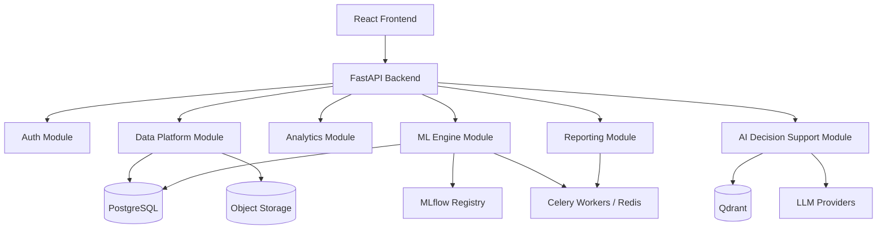

# Technical Requirements Document (TRD)

**Project:** MedIntel AI
**Document ID:** TRD-001
**Version:** v2.0
**Status:** Active
**Owner:** Subhranshu Panda
**Related:** `00_PROJECT_SCOPE.md`, `01_PRD.md`, `docs/architecture/adr/`

---

# Table of Contents

1. Technical Overview
2. High-Level Architecture
3. Technology Stack
4. Architecture Decisions (index → ADRs)
5. Backend Architecture
6. Frontend Architecture
7. AI Architecture (RAG + LLM)
8. ML Architecture (Training, Serving, Explainability)
9. Data Platform Architecture (Ingestion & Versioning)
10. Reporting Architecture
11. Database Design
12. API Specification (by Pillar)
13. Security Architecture
14. Testing Strategy
15. Deployment Strategy
16. Technical Risks & Future Roadmap

---

# 1. Technical Overview

## Purpose
Defines the technical architecture for all five product pillars (Patient Data Platform, Clinical Analytics Dashboard, ML Engine, AI Decision Support, Reporting). Where a decision has a dedicated ADR, this document references it rather than repeating the rationale.

## Objectives
Scalability, maintainability, reliability, performance, security, extensibility, explainability-by-design.

## Audience
AI coding agents and human contributors implementing MedIntel AI.

---

# 2. High-Level Architecture

Architecture style: **Modular Monolith** (ADR-008). New pillars are new modules within the same backend, not new services.

---

# 3. Technology Stack

| Layer | Stack |
|---|---|
| Frontend | React 19, TypeScript, Vite, Tailwind, shadcn/ui, Zustand, React Router, RHF/Zod, Recharts |
| Backend | FastAPI, Python 3.12+, SQLAlchemy 2.0, Pydantic v2, Alembic, JWT/OAuth2 |
| AI/LLM | LangChain + LangGraph, multi-provider (OpenAI/Anthropic/Gemini), Qdrant, RAG |
| ML | scikit-learn, XGBoost, SHAP, MLflow (ADR-010, ADR-011) |
| Data Platform | pandas, schema-validation library (pandera/great-expectations), PostgreSQL + object storage (ADR-009) |
| Reporting | WeasyPrint, Jinja2, pandas/openpyxl (ADR-012) |
| Background Jobs | Celery + Redis (ADR-010) |
| Databases | PostgreSQL, Qdrant |
| Infra | Docker, GitHub Actions, Nginx, Railway/Render now, AWS later |

Full selection rationale for each item lives in its ADR, not here.

---

# 4. Architecture Decisions (Index)

| ADR | Decision |
|---|---|
| 001 | FastAPI as backend framework |
| 002 | React + TypeScript as frontend |
| 003 | PostgreSQL as relational database |
| 004 | Qdrant as vector database |
| 005 | LangChain + LangGraph for orchestration |
| 006 | Docker for containerization |
| 007 | GitHub Actions for CI/CD |
| 008 | Modular Monolith architecture |
| 009 | Dataset versioning strategy |
| 010 | ML model training, registry, and serving strategy |
| 011 | SHAP as explainability tooling |
| 012 | Reporting and export tooling |

Any new architectural decision must be added here as a new ADR, not described inline in this TRD (per `.ai/rules/documentation.md`).

---

# 5. Backend Architecture

Layered per module: **API layer → Service layer → Repository layer → Database layer** (unchanged from v1). Each of the five pillars is implemented as its own set of routers/services/repositories under this same layering — no new architectural pattern is introduced per pillar. Any deviation from the repository/service pattern must be flagged explicitly before implementation, per `.ai/agents/claude.md` workflow rules.

---

# 6. Frontend Architecture

Unchanged core pattern: Zustand for client state, React Router for navigation, RHF/Zod for forms, Recharts for all pillar dashboards (analytics, ML comparison views, reporting previews) to keep one charting library across the app rather than introducing a second one per pillar.

---

# 7. AI Architecture (RAG + LLM) — AI Decision Support Pillar

- All LLM calls route through the existing multi-provider abstraction layer (OpenAI/Anthropic/Gemini) — never hardcode a provider (per workflow rules).
- RAG pipeline (retrieval → Qdrant → LLM synthesis → citation) is unchanged from v1 and now also serves: (a) Q&A over uploaded datasets, (b) natural-language explanation of SHAP output, (c) patient summary generation — all as new LangGraph flows reusing the same retrieval/generation primitives.
- Prediction explanations are **grounded**: the LLM is given the actual stored SHAP values (ADR-011) as context and asked to narrate them, not asked to explain a prediction from scratch.

---

# 8. ML Architecture — ML Engine Pillar

Full detail: ADR-010 (training/serving/registry) and ADR-011 (SHAP). Summary:

- Training executes as a Celery background job against a specific `dataset_version_id`.
- MLflow tracks every run (params, metrics, artifact); registry stage (`Staging`/`Production`) determines which model serves live predictions.
- Inference is synchronous FastAPI; SHAP `TreeExplainer` values are computed at prediction time and persisted with the prediction record.

---

# 9. Data Platform Architecture — Patient Data Platform Pillar

Full detail: ADR-009. Summary: uploads stored as immutable objects; `datasets` / `dataset_versions` tables in PostgreSQL track lineage; validation/cleaning steps produce new versions rather than mutating existing ones. Any endpoint touching uploaded patient-level data must be flagged for privacy/compliance review — do not assume de-identification has occurred upstream.

---

# 10. Reporting Architecture — Reporting Pillar

Full detail: ADR-012. Summary: Jinja2 HTML templates → WeasyPrint PDF conversion, reusing dashboard design tokens; CSV/XLSX via pandas/openpyxl; large exports run as Celery jobs with polling.

---

# 11. Database Design

## Core tables (existing + new)
| Table | Purpose |
|---|---|
| `users` | Auth (unchanged from v1) |
| `datasets`, `dataset_versions` | Patient Data Platform (ADR-009) |
| `models`, `training_runs` | ML Engine, mirrors MLflow registry state locally for API queries |
| `predictions` | Prediction + SHAP payload (JSONB), FK to `dataset_versions` and `training_runs` |
| `conversations`, `messages` | AI Decision Support (unchanged from v1 chat schema) |
| `documents`, `chunks` | RAG knowledge base (unchanged from v1) |
| `reports` | Generated report metadata + storage pointer (ADR-012) |
| `audit_logs` | Cross-cutting audit trail |

Vector storage (embeddings) remains in Qdrant, not PostgreSQL, per ADR-004.

---

# 12. API Specification (by Pillar)

| Pillar | Representative Endpoints |
|---|---|
| Auth | `POST /auth/register`, `POST /auth/login` |
| Data Platform | `POST /datasets`, `GET /datasets/{id}/versions`, `POST /datasets/{id}/validate` |
| Analytics | `GET /analytics/prevalence`, `GET /analytics/risk-distribution`, `GET /analytics/kpis` |
| ML Engine | `POST /ml/train`, `GET /ml/models/compare`, `POST /ml/predict`, `GET /ml/predictions/{id}/explanation` |
| AI Decision Support | `POST /chat`, `POST /chat/explain-prediction`, `POST /chat/patient-summary` |
| Reporting | `POST /reports/pdf`, `POST /reports/export`, `GET /reports/{job_id}/status` |

Full request/response schemas to be defined per-endpoint during implementation (Pydantic v2 models), not pre-specified in this document to avoid drift from actual code.

---

# 13. Security Architecture

JWT auth, bcrypt hashing, role-based authorization (unchanged from v1). New for this scope: every dataset-upload and prediction endpoint is treated as a potential patient-data handling point and logged to `audit_logs`; de-identification is never assumed — flag for compliance review at implementation time per workflow rules, even though v1 assumes only public/synthetic data.

---

# 14. Testing Strategy

Unit tests per service layer, integration tests per module, frontend component tests, end-to-end tests for the five core user journeys (upload → predict → explain → report, plus RAG chat). Target >80% coverage per `00_PROJECT_SCOPE.md`.

---

# 15. Deployment Strategy

Docker Compose for local dev now includes: backend, frontend, PostgreSQL, Qdrant, Redis, Celery worker, MLflow tracking server (ADR-010) — a materially larger compose file than v1's chatbot-only setup. Railway/Render for initial hosting; AWS deferred.

---

# 16. Technical Risks & Future Roadmap

**Risks:** New infra (MLflow, Celery, Redis) adds operational surface area for a solo developer — mitigated by containerizing everything and keeping local dev parity with prod. SHAP computation cost at scale — mitigated by TreeExplainer + async global summaries (ADR-011).

**Future (post-v1):** Multi-hospital tenancy, microservice extraction from the modular monolith if a pillar outgrows it, AWS migration.

---

## Document Information

**Version History:**
- v1.0 — RAG-chatbot-framed TRD (superseded)
- v2.0 — Five-pillar platform TRD, decisions consolidated into ADRs (current)

## End of Document
