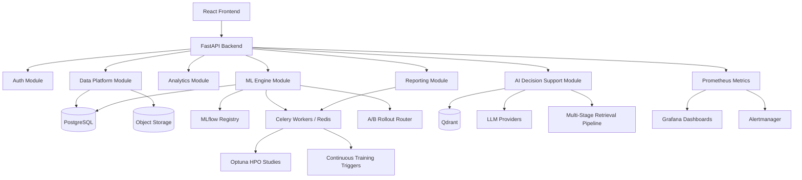

# Technical Requirements Document (TRD)

**Project:** MedIntel AI
**Document ID:** TRD-001
**Version:** v3.0
**Status:** Active
**Owner:** Subhranshu Panda
**Related:** `00_PROJECT_SCOPE.md`, `00_VISION_ML_PLATFORM.md`, `01_PRD.md`, `docs/architecture/adr/`

---

# Table of Contents

1. Technical Overview
2. High-Level Architecture
3. Technology Stack
4. Architecture Decisions (index → ADRs)
5. Backend Architecture
6. Frontend Architecture
7. AI Architecture (RAG + LLM)
8. ML Architecture (Training, Serving, Explainability)
9. ML Infrastructure & Continuous Training Pipeline
10. ML Monitoring & Alerting Architecture
11. A/B Testing & Progressive Rollout Architecture
12. Data Platform Architecture (Ingestion, Versioning, Feature Store)
13. Reporting Architecture
14. Database Design
15. API Specification (by Pillar)
16. Security & Compliance Architecture
17. Testing & Evaluation Strategy
18. Deployment Strategy
19. Technical Risks & Future Roadmap

---

# 1. Technical Overview

## Purpose
Defines the technical architecture for MedIntel AI as a full production-grade
healthcare ML platform (`00_VISION_ML_PLATFORM.md`), not a demo RAG chatbot:
the original five product pillars (Patient Data Platform, Clinical Analytics
Dashboard, ML Engine, AI Decision Support, Reporting) plus the MLOps,
evaluation, and compliance layers that make the ML Engine and AI Decision
Support pillars production-credible. Where a decision has a dedicated ADR,
this document references it rather than repeating the rationale.

## Objectives
Scalability, maintainability, reliability, performance, security,
extensibility, explainability-by-design, **and now**: reproducible training
(every model traceable to data + hyperparameters), continuous validity
(drift/fairness monitored, not assumed), and governed rollout (no model
change reaches users without a statistical and fairness gate).

## Audience
AI coding agents and human contributors implementing MedIntel AI.

---

# 2. High-Level Architecture

Architecture style: **Modular Monolith** (ADR-008). New pillars and MLOps
capabilities are new modules within the same backend, not new services —
this holds even as the platform grows to include continuous training,
monitoring, and rollout control (ADR-015–019 all build on top of the
monolith, none introduce a separate service).

---

# 3. Technology Stack

| Layer | Stack |
|---|---|
| Frontend | React 19, TypeScript, Vite, Tailwind, shadcn/ui, Zustand, React Router, RHF/Zod, Recharts |
| Backend | FastAPI, Python 3.12+, SQLAlchemy 2.0, Pydantic v2, Alembic, JWT/OAuth2 |
| AI/LLM | LangChain + LangGraph, multi-provider (OpenAI/Anthropic/Gemini), Qdrant, RAG |
| Advanced Retrieval | ColBERT (dense), BM25 (sparse), Reciprocal Rank Fusion, cross-encoder re-ranker, citation graph traversal (ADR-017) |
| ML | scikit-learn, XGBoost, SHAP, MLflow (ADR-010, ADR-011) |
| ML Optimization & Continuous Training | Optuna (HPO), Celery beat (scheduled/triggered retraining) (ADR-015) |
| ML Monitoring | Prometheus, Grafana, Alertmanager; KS-test (data drift), Wasserstein distance (model drift) (ADR-016) |
| Experimentation | In-process cohort router, two-proportion z-test / bootstrap CI for rollout significance (ADR-019) |
| Data Platform | pandas, pandera for schema/data validation (ADR-014), PostgreSQL + object storage (ADR-009) |
| Clinical Training Data | MIMIC-III (PhysioNet credentialed access) for Models 1–2; synthetic data as interim/CI fallback (ADR-018) |
| Reporting | WeasyPrint, Jinja2, pandas/openpyxl (ADR-012) |
| Background Jobs | Celery + Redis (ADR-010, extended by ADR-015/016/019 for scheduled jobs) |
| Databases | PostgreSQL, Qdrant |
| Infra | Docker, GitHub Actions, Nginx, Railway/Render now, AWS later |

Full selection rationale for each item lives in its ADR, not here.

---

# 4. Architecture Decisions (Index)

| ADR | Decision |
|---|---|
| 001 | FastAPI as backend framework |
| 002 | React + TypeScript as frontend |
| 003 | PostgreSQL as relational database |
| 004 | Qdrant as vector database |
| 005 | LangChain + LangGraph for orchestration |
| 006 | Docker for containerization |
| 007 | GitHub Actions for CI/CD |
| 008 | Modular Monolith architecture |
| 009 | Dataset versioning strategy |
| 010 | ML model training, registry, and serving strategy |
| 011 | SHAP as explainability tooling |
| 012 | Reporting and export tooling |
| 013 | SQLAlchemy 2.0 (async) + Alembic for ORM and migrations |
| 014 | pandera for dataset schema/data validation |
| 015 | Continuous training pipeline with Optuna hyperparameter optimization |
| 016 | ML monitoring & alerting stack (Prometheus + Grafana) |
| 017 | Advanced multi-stage RAG retrieval pipeline |
| 018 | MIMIC-III as clinical training data source |
| 019 | A/B testing & progressive model rollout framework |

Any new architectural decision must be added here as a new ADR, not described
inline in this TRD (per `.ai/rules/documentation.md`).

---

# 5. Backend Architecture

Layered per module: **API layer → Service layer → Repository layer →
Database layer** (unchanged from v1/v2). Each pillar — including the newer
ML Engine sub-capabilities (training orchestration, monitoring, rollout) —
is implemented as its own set of routers/services/repositories under this
same layering; no new architectural pattern is introduced per pillar or
per MLOps capability. Any deviation from the repository/service pattern
must be flagged explicitly before implementation, per `.ai/agents/claude.md`
workflow rules. Scheduled jobs (Optuna-driven retraining, drift/fairness
monitoring sweeps, A/B rollout evaluation) are Celery beat tasks that call
into the same service layer the API uses — there is no separate "batch"
code path that duplicates business logic.

---

# 6. Frontend Architecture

Unchanged core pattern: Zustand for client state, React Router for
navigation, RHF/Zod for forms, Recharts for all pillar dashboards
(analytics, ML comparison views, reporting previews, and the new cohort
analysis / disease pattern mining views) to keep one charting library
across the app rather than introducing a second one per pillar. Grafana
dashboards (ADR-016) are a separate, ops-facing surface (not embedded in
the product frontend) — Recharts remains the only charting library inside
the React app itself, avoiding a second frontend charting dependency.

---

# 7. AI Architecture (RAG + LLM) — AI Decision Support Pillar

- All LLM calls route through the existing multi-provider abstraction layer
  (OpenAI/Anthropic/Gemini) — never hardcode a provider (per workflow rules).
- **Retrieval is now a 7-stage pipeline** (ADR-017), replacing single-stage
  dense vector search:
  1. Dense passage retrieval (ColBERT embeddings, Qdrant named vectors)
  2. Sparse BM25 keyword matching (parallel to stage 1)
  3. Metadata filtering (publication year, journal quality, source type)
  4. Reciprocal Rank Fusion (combines stages 1–3)
  5. Cross-encoder re-ranking (top-N fused candidates)
  6. Citation graph traversal (related/citing papers)
  7. Temporal decay (recency weighting on the final ranking)

  Each stage is a LangGraph node so it can be independently evaluated
  (`08_EVALUATION_FRAMEWORK.md`) and swapped without redesigning the pipeline.
- The same retrieval pipeline serves: (a) Q&A over uploaded datasets and
  medical literature, (b) natural-language explanation of SHAP output,
  (c) patient summary generation — as LangGraph flows reusing the same
  retrieval/generation primitives, not separate pipelines per use case.
- Prediction explanations are **grounded**: the LLM is given the actual
  stored SHAP values (ADR-011) as context and asked to narrate them, not
  asked to explain a prediction from scratch.
- **Latency budget**: the 7-stage pipeline is materially slower than
  single-stage dense search; stages 1–2 run in parallel, but stages 4–7 are
  sequential. The < 500ms (p95) retrieval target from `00_VISION_ML_PLATFORM.md`
  requires per-stage latency budgeting (tracked in §9 and `12_MONITORING_ALERTS.md`),
  not assumed by default — this is called out explicitly as a design risk in §19.

---

# 8. ML Architecture — ML Engine Pillar

Full detail: ADR-010 (training/serving/registry), ADR-011 (SHAP). Summary:

- Training executes as a Celery background job against a specific
  `dataset_version_id` — manual, scheduled, or drift-triggered runs all go
  through this same job type (ADR-015), so there is one training pipeline,
  not a parallel "automated" one.
- MLflow tracks every run (params, metrics, artifact); registry stage
  (`Staging`/`Production`/`Archived`) determines which model serves live
  predictions, subject to the A/B promotion gate in §11.
- Inference is synchronous FastAPI; SHAP `TreeExplainer` values are computed
  at prediction time and persisted with the prediction record.
- **Three models now in scope** (`00_VISION_ML_PLATFORM.md`): Patient Risk
  Stratification (XGBoost), Treatment Outcome Predictor (Random Forest +
  Gradient Boosting ensemble), and the Literature Relevance Ranker (§7's
  retrieval pipeline, evaluated as a ranking model even though it isn't a
  classifier in the traditional sense). Full model-level architecture,
  hyperparameter search spaces, and evaluation targets: `06_ML_MODELS.md`.

---

# 9. ML Infrastructure & Continuous Training Pipeline

Full detail: ADR-015. Summary:

- **Optuna** runs hyperparameter search inside the same Celery training job
  ADR-010 defines; each Optuna study is an MLflow parent run, each trial a
  nested run, so the registry shows the full search, not just the winner.
- **Retraining triggers**, evaluated by a Celery beat scheduled task:
  weekly schedule, data drift (KS-test vs. training snapshot, §10),
  or performance degradation (rolling eval down > 3% from registered
  baseline). Any trigger enqueues the standard training+Optuna job.
- The best trial auto-registers to MLflow `Staging`; promotion to
  `Production` is gated by §11, never automatic from Optuna alone.
- **Operational note**: Celery beat is a new always-on component — if it
  silently stops, retraining silently stops with it. Monitored per §10
  rather than assumed healthy.

---

# 10. ML Monitoring & Alerting Architecture

Full detail: ADR-016. Summary:

- **Prometheus** scrapes FastAPI (`prometheus-fastapi-instrumentator`) and
  Celery worker metrics; model-specific metrics (prediction distribution,
  feature distribution, drift statistics, fairness gaps) are pushed as
  custom gauges/histograms from inference and monitoring-job code.
- **Drift detection**: Kolmogorov–Smirnov test per input feature (data
  drift), Wasserstein distance on the prediction distribution (model
  drift) — a Celery beat job on the same scheduling mechanism as §9,
  writing results to both Prometheus and a `model_monitoring_snapshots`
  table (historical audit trail, consistent with the project's
  audit-everything stance from ADR-009/#31).
- **Fairness monitoring**: equalized odds / demographic parity / predictive
  parity computed per protected attribute available in the (synthetic)
  patient data, exported as `fairness_gap{group=...}` gauges.
- **Alerting** (Alertmanager → Slack/email — not a paging service; there is
  no real on-call rotation on a portfolio project, and doc/demo content
  should say so rather than imply otherwise): API p95 latency thresholds,
  error rate > 5%, model metric drop > 5%, fairness gap > 5%, drift over
  threshold.
- **Dashboards** (Grafana, provisioned as code in
  `infrastructure/grafana/`): system health, model performance trends,
  fairness trends, cost tracking, data quality. Full panel spec:
  `12_MONITORING_ALERTS.md`.
- **Caveat that must travel with every dashboard/demo of this system**:
  drift and fairness numbers computed against synthetic (or MIMIC-III
  research-only) data demonstrate the *methodology*, not real-world model
  fairness — do not oversell what these numbers prove (ADR-016 Negative
  consequences).

---

# 11. A/B Testing & Progressive Rollout Architecture

Full detail: ADR-019. Summary:

- In-process router assigns each inference request to `candidate` or
  `incumbent` via a deterministic hash of the patient/session id
  (consistent per-patient assignment across a rollout).
- Metrics aggregated per cohort from `PredictionLog`, tagged with serving
  model version; includes the fairness metrics from §10, not just the
  primary accuracy metric.
- **Auto-promotion gate**: candidate → `Production` only if, over a
  minimum 7-day window, its primary metric beats the incumbent by > 2%,
  the result is statistically significant (p < 0.05), and no fairness
  metric has regressed past the §10 alert threshold. Any failing condition
  blocks promotion and surfaces it (report-only autonomy) rather than
  retrying or overriding.
- Rollback is a registry stage change (no version is ever deleted, per
  ADR-010), not a redeploy.
- Same caveat as §10: on synthetic/non-production traffic, a rollout result
  validates the *mechanism*, not a real-world outcome claim.

---

# 12. Data Platform Architecture — Patient Data Platform Pillar

Full detail: ADR-009 (versioning), ADR-014 (pandera validation), ADR-018
(MIMIC-III). Summary:

- Uploads stored as immutable objects; `datasets` / `dataset_versions`
  tables in PostgreSQL track lineage; validation/cleaning steps produce
  new versions rather than mutating existing ones.
- **Schema/data validation** (ADR-014): pandera, generic `DataFrameSchema`
  checks for arbitrary uploads today, named `DataFrameModel` classes for
  specific clinical pathways as they're formalised; failures serialise
  into `DatasetVersion.validation_report` (JSONB).
- **Clinical training data** (ADR-018): MIMIC-III via credentialed
  PhysioNet access for Models 1–2, with synthetic data as the interim/CI
  fallback while credentialing is pending (tracked as an active risk,
  `.ai/memory/project-memory.md`). MIMIC-III data never enters the
  repository, public artifact store, or a public-facing demo.
- **Feature Store (lightweight)**: rather than adopting a dedicated feature
  store product (Feast, Tecton — out of scope for this project's
  scale/budget per the same reasoning as ADR-009's rejection of DVC/LakeFS),
  engineered features are materialised as versioned columns/tables
  alongside `dataset_versions`, keyed by `dataset_version_id` so every
  feature set used in training remains traceable to its source data
  version. Full ETL, feature engineering, and data-quality detail:
  `09_DATA_PIPELINE.md`.
- **Patient data management**: `Patient` and `MedicalRecord` entities
  (OCR'd documents, structured extraction of medications/diagnoses/labs,
  patient timeline) extend this pillar — full design: `10_PATIENT_MANAGEMENT.md`,
  schema: `05_BACKEND_DESIGN.md`.
- Any endpoint touching uploaded or extracted patient-level data must be
  flagged for privacy/compliance review — do not assume de-identification
  has occurred upstream, per the project's GDPR-aware, treat-synthetic-as-real-PHI stance.

---

# 13. Reporting Architecture — Reporting Pillar

Full detail: ADR-012. Summary: Jinja2 HTML templates → WeasyPrint PDF
conversion, reusing dashboard design tokens; CSV/XLSX via pandas/openpyxl;
large exports run as Celery jobs with polling. Reporting now also covers
model monitoring/fairness summaries as an exportable artifact (not just
patient-facing reports), reusing the same rendering pipeline.

---

# 14. Database Design

## Core tables (existing + new)
| Table | Purpose |
|---|---|
| `users` | Auth (unchanged from v1) |
| `datasets`, `dataset_versions` | Patient Data Platform (ADR-009, ADR-014) |
| `patients`, `medical_records` | Patient data management (new — full schema in `05_BACKEND_DESIGN.md`) |
| `models`, `training_runs` | ML Engine, mirrors MLflow registry state locally for API queries |
| `predictions` (→ `PredictionLog`) | Prediction + SHAP payload (JSONB), FK to `dataset_versions` and `training_runs`, tagged with serving model version for A/B analysis (ADR-019) |
| `risk_scores`, `treatment_outcomes` | Model-1/Model-2 specific prediction detail beyond the generic `predictions` record (new) |
| `model_monitoring_snapshots` | Drift/fairness monitoring history (ADR-016, new) |
| `annotated_data` | Labelled data for model training/evaluation, incl. retrieval relevance judgments (ADR-017, new) |
| `conversations`, `messages` | AI Decision Support (unchanged from v1 chat schema) |
| `documents`, `chunks` | RAG knowledge base (unchanged from v1) |
| `reports` | Generated report metadata + storage pointer (ADR-012) |
| `audit_logs` | Cross-cutting audit trail |

Vector storage (embeddings) remains in Qdrant, not PostgreSQL, per ADR-004;
ColBERT's multi-vector representation (ADR-017) is stored as Qdrant named
vectors on the same collection, not a new database. Full entity-level
schema (columns, relationships, migration plan) for the new tables above:
`05_BACKEND_DESIGN.md` (in progress).

---

# 15. API Specification (by Pillar)

| Pillar | Representative Endpoints |
|---|---|
| Auth | `POST /auth/register`, `POST /auth/login` |
| Data Platform | `POST /datasets`, `GET /datasets/{id}/versions`, `POST /datasets/{id}/validate` |
| Patient Management | `POST /patients`, `GET /patients/{id}/timeline`, `POST /patients/{id}/records` |
| Analytics | `GET /analytics/prevalence`, `GET /analytics/risk-distribution`, `GET /analytics/kpis`, `GET /analytics/cohorts` |
| ML Engine | `POST /ml/train`, `GET /ml/models/compare`, `POST /ml/predict`, `GET /ml/predictions/{id}/explanation` |
| ML Ops (admin) | `GET /ml/experiments`, `POST /ml/rollouts`, `GET /ml/rollouts/{id}/results`, `GET /ml/monitoring/drift`, `GET /ml/monitoring/fairness` |
| AI Decision Support | `POST /chat`, `POST /chat/explain-prediction`, `POST /chat/patient-summary` |
| Reporting | `POST /reports/pdf`, `POST /reports/export`, `GET /reports/{job_id}/status` |

Full request/response schemas to be defined per-endpoint during
implementation (Pydantic v2 models), not pre-specified in this document to
avoid drift from actual code.

---

# 16. Security & Compliance Architecture

JWT auth, bcrypt hashing, role-based authorization (unchanged from v1).
Every dataset-upload, patient-record, and prediction endpoint is treated as
a potential patient-data handling point and logged to `audit_logs`;
de-identification is never assumed. HIPAA (de-identification, encryption at
rest/in transit, access controls, audit logging) and GDPR (right to
deletion, right to portability, consent tracking, data processing
agreements) requirements are detailed in `11_PRIVACY_COMPLIANCE.md` — this
section only summarises the architectural hooks (audit middleware, RBAC)
that compliance depends on. MIMIC-III-specific handling (DUA compliance,
storage isolation, never entering public artifacts) is defined in ADR-018.

---

# 17. Testing & Evaluation Strategy

Unit tests per service layer, integration tests per module, frontend
component tests, end-to-end tests for the core user journeys (upload →
validate → predict → explain → report, plus RAG chat). Target >80%
coverage per `00_PROJECT_SCOPE.md`. **Beyond code-correctness testing**, the
platform now requires model/retrieval **evaluation** as a distinct,
continuous discipline — retrieval quality (NDCG, Precision@k, citation
accuracy), generation quality (hallucination rate, medical accuracy),
prediction quality (ROC-AUC, calibration), and fairness (equalized odds,
demographic/predictive parity) are not covered by unit tests and have their
own framework: `08_EVALUATION_FRAMEWORK.md`.

---

# 18. Deployment Strategy

Docker Compose for local dev now includes: backend, frontend, PostgreSQL,
Qdrant, Redis, Celery worker + beat, MLflow tracking server (ADR-010),
**and** Prometheus + Grafana + Alertmanager (ADR-016) — a materially larger
compose file than v2's. Railway/Render for initial hosting; AWS deferred.
MIMIC-III-derived artifacts (trained models, not raw data) may be deployed;
raw MIMIC-III data itself never leaves the private development/training
environment (ADR-018) and is explicitly excluded from any deployed or
public-facing environment.

---

# 19. Technical Risks & Future Roadmap

**Risks:**
- New infra (MLflow, Celery, Redis, Prometheus, Grafana, Alertmanager) adds
  significant operational surface area for a solo developer — mitigated by
  containerizing everything and keeping local dev parity with prod.
- SHAP computation cost at scale — mitigated by TreeExplainer + async
  global summaries (ADR-011).
- **7-stage RAG pipeline latency** (§7) risks missing the < 500ms (p95)
  target; requires explicit per-stage latency budgeting and parallelisation
  where possible (stages 1–2), tracked as an open design item, not assumed
  solved by this document.
- **MIMIC-III credentialing** (ADR-018) is an external-timeline dependency
  on the critical path for Models 1–2's real-data validation — tracked in
  `.ai/memory/project-memory.md`'s Risk Register with an immediate action
  item, not treated as a formality.
- **Overall scope vs. timeline**: the full platform scope
  (`00_VISION_ML_PLATFORM.md`) is materially larger than the original
  five-pillar MVP, against an unchanged November 2026 interview-readiness
  target and an MSc starting September 2026 that will reduce available
  hours — flagged explicitly in the Risk Register rather than silently
  absorbed; per `CLAUDE.md`'s binding scope mandate, the response to a
  timeline conflict is to surface it, not to quietly descope.

**Future (post-v1):** Multi-hospital tenancy, microservice extraction from
the modular monolith if a pillar outgrows it, AWS migration, a dedicated
feature store product if the lightweight versioned-column approach (§12)
stops scaling.

---

## Document Information

**Version History:**
- v1.0 — RAG-chatbot-framed TRD (superseded)
- v2.0 — Five-pillar platform TRD, decisions consolidated into ADRs (superseded)
- v3.0 — Full production ML platform TRD: continuous training (ADR-015),
  ML monitoring (ADR-016), advanced RAG retrieval (ADR-017), MIMIC-III data
  source (ADR-018), A/B testing/rollout (ADR-019) (current)

## End of Document
