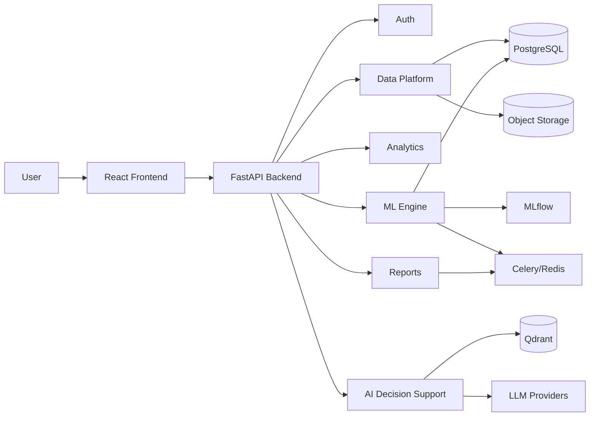

# Application Flow Document (APP_FLOW)

**Version:** v2.0
**Status:** Active
**Related:** `01_PRD.md`, `02_TRD.md`, `docs/architecture/adr/`

---

# 1. Purpose

Describes user-facing flows for all five pillars. Superseded v1.0 covered only Auth + RAG Chat; this version adds Data Platform, Analytics, ML Engine, and Reporting flows.

---

# 2. Scope

Covers: onboarding/auth, data upload & versioning, analytics dashboard interaction, ML training/prediction/explanation, AI Decision Support chat, and report generation/export.

---

# 3. User Roles

- **Standard User** — uploads data, views analytics, runs predictions, uses AI chat, generates reports.
- **Admin** — user management, model version management, audit log access.

---

# 4. High-Level User Journey

1. Register / log in.
2. Upload a dataset → validated → versioned.
3. Explore it on the Analytics Dashboard.
4. Train or select a model → run predictions → view SHAP explanation.
5. Ask AI Decision Support natural-language questions about the data, a prediction, or medical literature.
6. Export findings as a PDF/CSV/executive report.

---

# 5. Flow: Authentication & Onboarding

**Objective:** Secure entry into the platform.

1. User registers (email + password) → bcrypt hash stored.
2. User logs in → JWT issued.
3. JWT attached to all subsequent requests; role-based authorization applied per endpoint.

**Edge cases:** invalid credentials, expired token refresh, duplicate registration email.

---

# 6. Flow: Patient Data Platform (new)

**Objective:** Get a clean, versioned dataset into the system.

1. User uploads a CSV.
2. Backend validates schema (column presence/types) and flags row-level issues.
3. User reviews validation results; triggers cleaning if needed.
4. A new immutable `dataset_version` is created for the cleaned result (ADR-009).
5. Dataset becomes selectable across Analytics, ML Engine, and AI Decision Support modules.

**Edge cases:** malformed CSV, schema mismatch against an existing dataset, very large file requiring background processing rather than inline validation.

**Compliance note:** every upload is logged to `audit_logs`; de-identification is never assumed (per workflow rules) even though v1 assumes public/synthetic data only.

---

# 7. Flow: Clinical Analytics Dashboard (new)

**Objective:** Let users explore an active dataset visually.

1. User selects an active dataset (and version).
2. Dashboard renders prevalence, risk distribution, demographic, and time-series charts (Recharts).
3. User configures/filters KPI widgets.

**Edge cases:** dataset too small for meaningful demographic breakdowns; missing columns required for a given chart (graceful fallback, not a hard error).

---

# 8. Flow: ML Engine — Train, Predict, Explain (new)

**Objective:** Produce an explainable prediction.

1. User selects a dataset version and triggers training (Celery background job, ADR-010).
2. MLflow logs the run; user compares runs by ROC-AUC/precision/recall.
3. User promotes a run to `Production` in the registry.
4. User (or the system, per-patient) requests a prediction → served synchronously from the `Production` model.
5. SHAP `TreeExplainer` computes and persists the local explanation alongside the prediction (ADR-011).
6. User views the prediction with its SHAP explanation in the UI.

**Edge cases:** training job failure/timeout, no `Production` model yet registered, SHAP computation exceeding latency budget for very wide feature sets (mitigated by async global summaries).

---

# 9. Flow: AI Decision Support (RAG Chat)

**Objective:** Grounded natural-language interaction — unchanged core mechanics from v1, extended scope.

1. User asks a question (about the dataset, a specific prediction, or general medical literature).
2. Request routes through the existing multi-provider LLM abstraction (never a hardcoded provider).
3. For literature questions: Qdrant retrieval → citation-backed synthesis (unchanged RAG pipeline).
4. For "explain this prediction": stored SHAP values are pulled and passed as grounding context — the LLM narrates existing values, it does not generate an explanation independently.
5. For patient summaries: relevant dataset rows + prediction history are summarized.
6. Response streams to the UI with citations/sources where applicable.

**Edge cases:** low retrieval-confidence answers (surface uncertainty rather than fabricating), prediction-explanation requested for a patient with no stored prediction yet.

---

# 10. Flow: Reporting (new)

**Objective:** Turn dashboard/prediction/analytics output into a shareable artifact.

1. User requests a PDF report, CSV export, executive dashboard, or clinical summary.
2. Small exports render synchronously; large ones (full-cohort PDF, full dataset export) run as a Celery job (ADR-012) with a polling status endpoint.
3. User downloads the finished file.

**Edge cases:** report requested while underlying dataset/model is mid-retraining (should reference a specific version, not "whatever is live now"), very large cohort exports requiring pagination/streaming.

---

# 11. System Interaction Overview

---

## Document Information

**Version History:**
- v1.0 — Auth + RAG Chat flows only (superseded)
- v2.0 — Adds Data Platform, Analytics, ML Engine, and Reporting flows (current)

## End of Document
