# Application Flow Document (APP_FLOW)

| Field | Value |
|--------|-------|
| **Project** | MedIntel AI |
| **Document ID** | APP-001 |
| **Version** | v1.0 |
| **Status** | Draft |
| **Owner** | Subhranshu Panda |
| **Repository** | medintel-ai |
| **Last Updated** | July 2026 |

---

# 1. Purpose

The Application Flow document describes how users interact with MedIntel AI and how the system processes those interactions behind the scenes.

It bridges the gap between the Product Requirements Document (PRD) and the Technical Requirements Document (TRD) by documenting end-to-end workflows, system behavior, and AI processing pipelines.

This document serves as the operational blueprint for frontend, backend, AI/ML, QA, and future contributors.

---

# 2. Scope

Version **1.0** covers the complete lifecycle of a user session, including:

1 Authentication & Onboarding

2 AI Chat & RAG

3 Supporting Workflows

4 Future Expansion

---

# 3. User Roles

| Role | Primary Responsibilities |
|------|---------------------------|
| **Student** | Learn medical concepts using AI-assisted search and citations |
| **Researcher** | Retrieve, compare, and explore biomedical literature |
| **Healthcare Professional** | Access evidence-backed medical information |
| **Administrator** | Manage users, documents, AI configuration, and system health |

---

# 4. High-Level User Journey

The following workflow summarizes the complete application lifecycle.

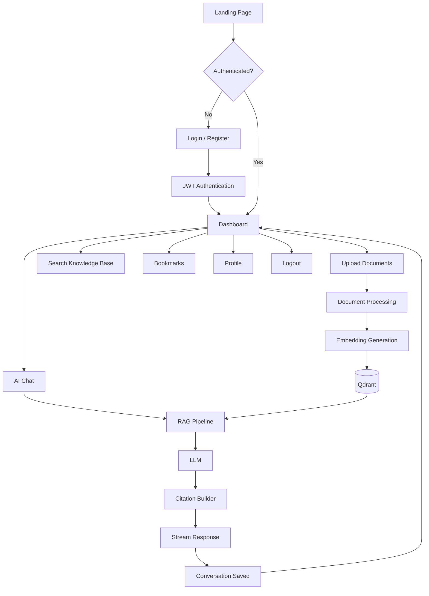

---

# 5. System Interaction Overview

The diagram below illustrates how the major system components collaborate to process a user request.

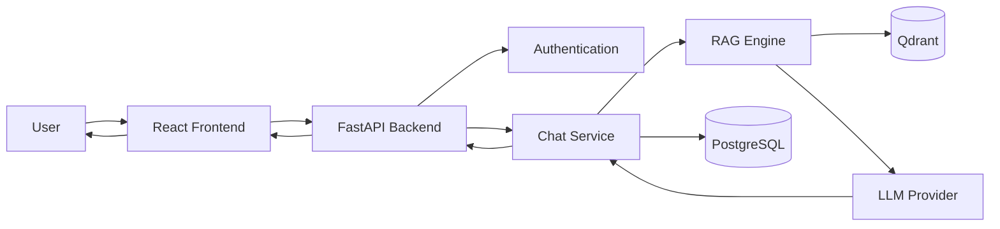

---

# 6. Key Application Modules

| Module | Description |
|---------|-------------|
| Authentication | Secure user registration, login, and session management |
| Dashboard | Central workspace for accessing all application features |
| AI Chat | Conversational interface powered by Retrieval-Augmented Generation |
| Document Management | Upload, process, and index medical literature |
| Semantic Search | Retrieve relevant medical knowledge using vector similarity |
| User Workspace | Conversation history, bookmarks, and profile management |
| Administration | User management, document indexing, monitoring, and AI configuration |

---

## Design Principles

Every workflow in this document follows the same engineering principles:

- User-first experience
- Explainable AI with citations
- Modular backend architecture
- Stateless APIs
- Secure by default
- Scalable RAG pipeline
- Minimal clicks for common tasks
- Consistent user experience across modules

---

## Workflow Roadmap

The remaining sections describe each workflow in detail.

1. Authentication Flow
2. User Onboarding
3. Dashboard Navigation
4. AI Chat Workflow
5. RAG Retrieval Workflow
6. Document Ingestion
7. Conversation Lifecycle
8. Search & Citation Flow
9. User Profile
10. Admin Workflow
11. Error Handling
12. Session Lifecycle
13. Navigation Map
14. Requirement Traceability
15. Future Enhancements

---

# 7. Authentication & User Onboarding

## Objective

Enable users to securely register, authenticate, and access the MedIntel AI platform while ensuring a smooth onboarding experience.

---

## Authentication Workflow

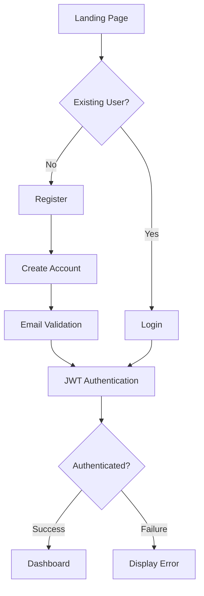

---

## Authentication Sequence

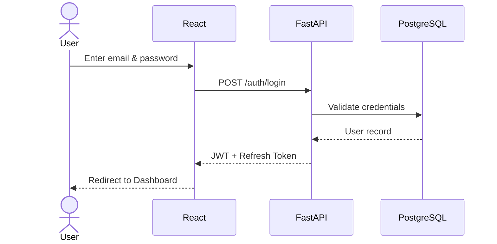

---

## User Onboarding Workflow

New users are guided through a lightweight onboarding process after successful registration.

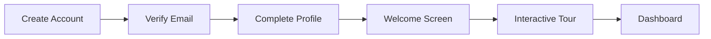

---

## Authentication States

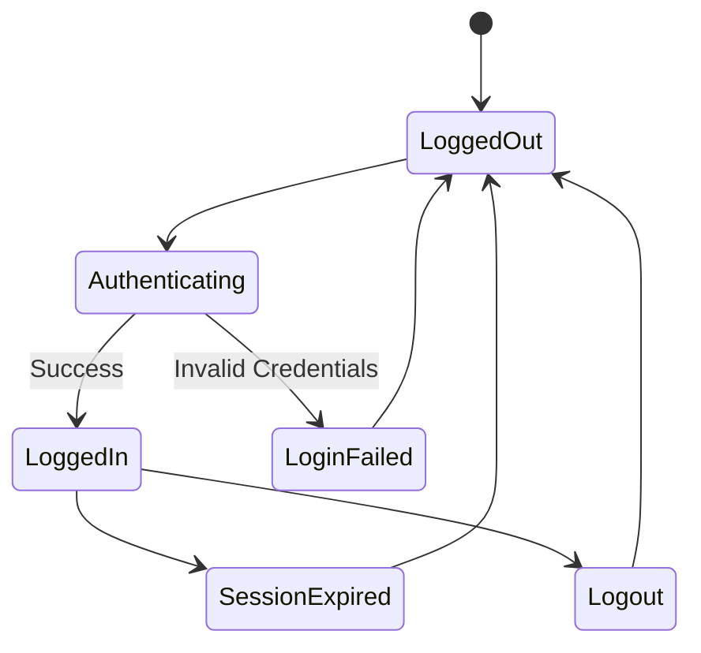

---

## Key Components

| Component | Responsibility |
|------------|----------------|
| React | Login & Registration UI |
| FastAPI | Authentication API |
| JWT | Stateless authentication |
| PostgreSQL | User credentials & roles |
| RBAC | Role-based authorization |

---

## Edge Cases

| Scenario | System Behaviour |
|-----------|------------------|
| Invalid credentials | Display validation message without revealing account existence |
| Expired token | Redirect to login after attempting refresh |
| Duplicate email | Prevent account creation with clear feedback |
| Weak password | Enforce password policy before registration |
| Network interruption | Preserve form data and allow retry |

---

## Related Requirements

| Document | Requirements |
|-----------|--------------|
| PRD | FR-001 – FR-005 |
| TRD | Authentication Architecture, Security Architecture |

---

## Developer Notes

- JWT-based authentication
- BCrypt password hashing
- Refresh token support
- Stateless backend sessions
- Future-ready for OAuth2 providers (Google, GitHub, Microsoft)

---

# 8. AI Chat & Retrieval-Augmented Generation (RAG) Workflow

## Objective

Enable users to ask natural language medical questions and receive accurate, citation-backed responses using a Retrieval-Augmented Generation (RAG) pipeline.

This workflow combines semantic search, Large Language Models (LLMs), and trusted medical literature to generate explainable AI responses.

---


✔ Retrieval-Augmented Generation

✔ Semantic Search

✔ Vector Database

✔ Prompt Engineering

✔ REST APIs

✔ Production Architecture

✔ Docker Ready

✔ Modular Design

## End-to-End AI Workflow

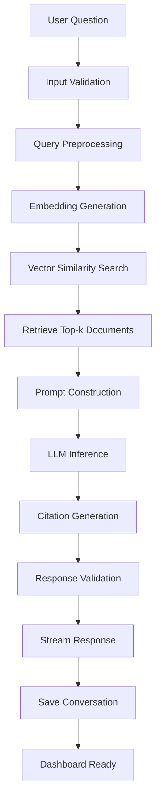

---

## AI Request Sequence

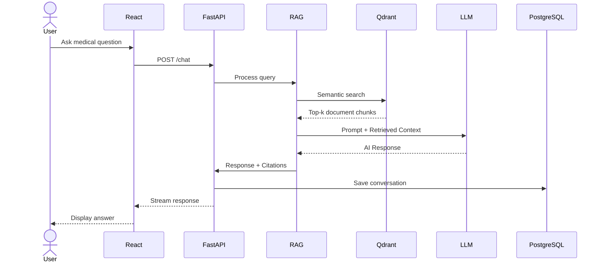

---

## RAG Pipeline Overview

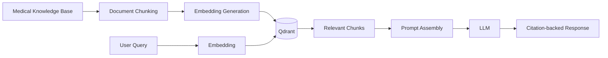

---

## AI Response Lifecycle

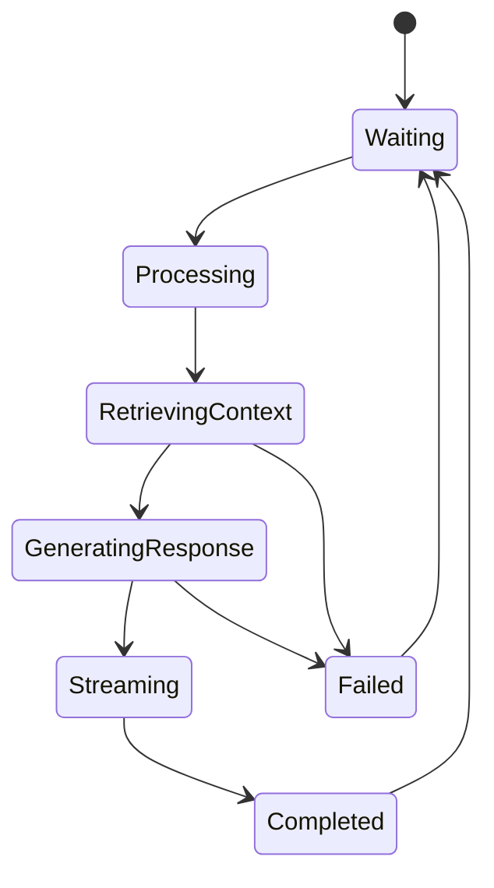

---

## AI Processing Pipeline

| Step | Purpose |
|------|---------|
| Input Validation | Validate user query and sanitize input |
| Query Preprocessing | Normalize and prepare text |
| Embedding Generation | Convert query into vector representation |
| Vector Search | Retrieve semantically relevant medical documents |
| Prompt Construction | Combine retrieved context with user query |
| LLM Inference | Generate grounded AI response |
| Citation Generation | Attach document references |
| Response Validation | Verify output structure |
| Conversation Storage | Persist chat history |

---

## Engineering Components

| Component | Technology |
|-----------|------------|
| Frontend | React + TypeScript |
| Backend API | FastAPI |
| AI Orchestration | LangChain + LangGraph |
| Vector Database | Qdrant |
| Relational Database | PostgreSQL |
| LLM Providers | OpenAI / Anthropic / Gemini |
| Streaming | Server-Sent Events (SSE) |

---

## Edge Cases

| Scenario | Expected Behaviour |
|-----------|-------------------|
| No relevant documents found | Return response with low-confidence notice |
| Vector database unavailable | Notify user and log retrieval failure |
| LLM timeout | Retry once before returning an error |
| Invalid prompt | Reject request with validation message |
| Empty response | Trigger fallback generation workflow |
| API rate limit exceeded | Queue or gracefully reject the request |

---

## Data Science Highlights

This workflow demonstrates several core data science and AI engineering concepts:

- Semantic embeddings
- Vector similarity search
- Retrieval-Augmented Generation (RAG)
- Prompt engineering
- Context ranking
- Explainable AI through citations
- AI response validation
- Conversation analytics

---

## Related Requirements

| Document | Sections |
|-----------|----------|
| PRD | FR-015 – FR-025 |
| TRD | AI Architecture, RAG Pipeline, API Lifecycle |

---

## Developer Notes

- Maintain stateless API requests.
- Keep LLM providers interchangeable through an abstraction layer.
- Log retrieval latency and token usage for future evaluation.
- Design the pipeline to support future reranking models and evaluation frameworks (e.g., Ragas).

---

# 9. Supporting Workflows & System Operations

The following workflows support the primary AI experience by enabling document management, user personalization, administration, and secure session handling.

---

## Application Navigation

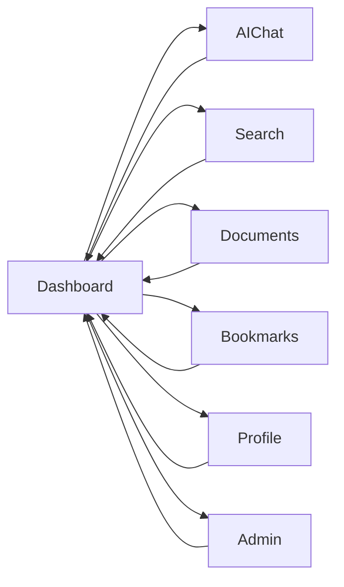

---

## Knowledge Base Management

Administrators continuously maintain the medical knowledge base used by the RAG pipeline.

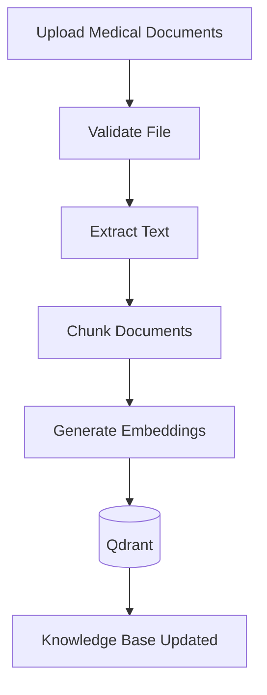

---

## User Workspace

Users can manage their personal workspace throughout their learning or research sessions.

```mermaid
flowchart LR

Dashboard

--> Conversations

--> Bookmarks

--> Saved Responses

--> Profile

--> Settings
```

---

## Administration Workflow

```mermaid
flowchart TD

AdminLogin

--> Dashboard

--> User Management

--> Document Management

--> AI Configuration

--> System Monitoring

--> Audit Logs

--> Logout
```

---

## Session Lifecycle

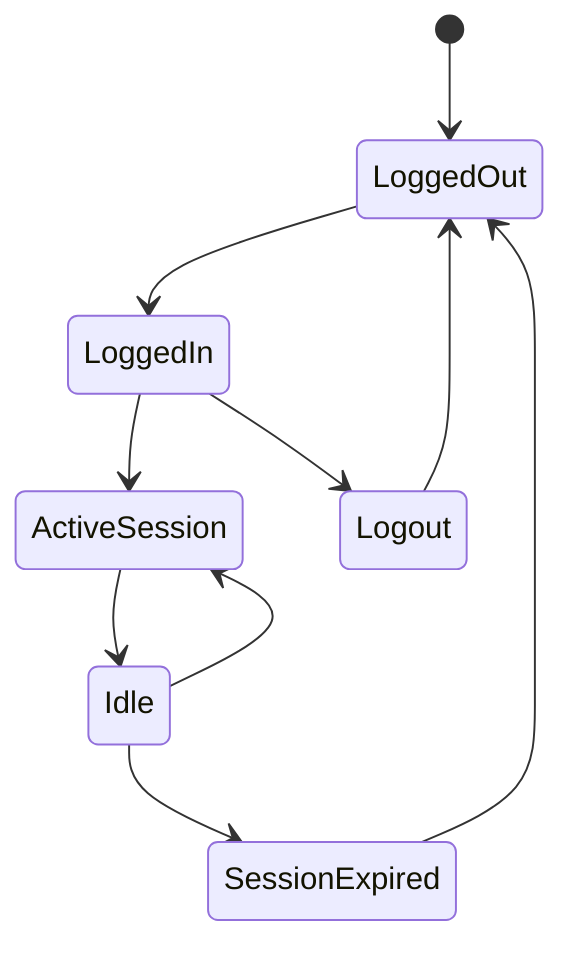

---

## Error Handling Workflow

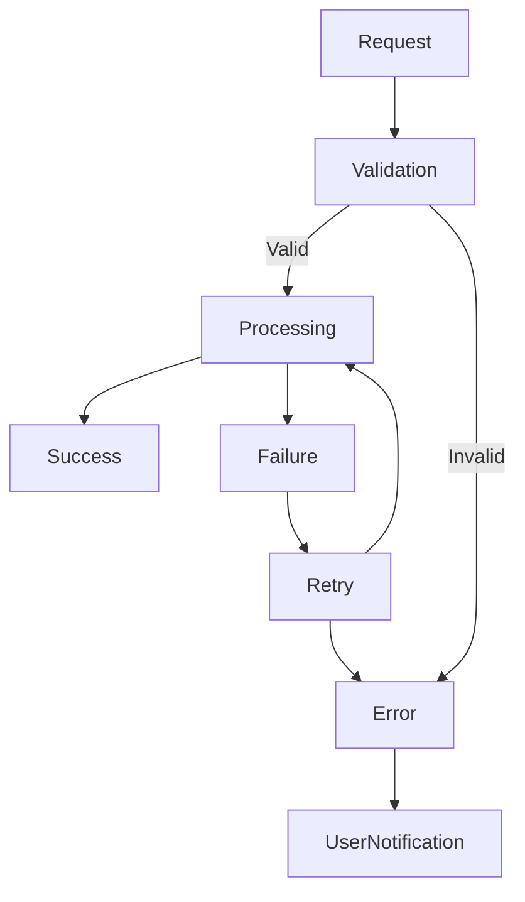

---

## Complete System Lifecycle

```mermaid
flowchart LR

User

--> Authentication

--> Dashboard

--> AI Chat

--> RAG Pipeline

--> Citation Generation

--> Conversation Storage

--> Analytics

--> Logout
```

---

## Workflow Summary

| Workflow | Purpose |
|----------|---------|
| Authentication | Secure access to the platform |
| Dashboard | Central navigation hub |
| AI Chat | Conversational medical intelligence |
| RAG Pipeline | Retrieval of trusted medical knowledge |
| Document Processing | Build and maintain the knowledge base |
| User Workspace | Manage conversations and bookmarks |
| Administration | Configure and monitor the platform |
| Session Management | Secure user sessions |
| Error Handling | Graceful recovery from failures |

---

Portfolio Highlights

• Production-ready architecture

• Modular backend

• Explainable AI

• Modern RAG pipeline

• Scalable REST APIs

• Docker deployment

• Enterprise documentation

• Clean engineering practices

---
Status : Frozen

Related Documents

00_PROJECT_SCOPE.md

01_PRD.md

02_TRD.md

04_UI_UX_BRIEF.md

05_BACKEND_SCHEMA.md

The workflows described in this document serve as the operational blueprint for implementing MedIntel AI Version 1.0.

Future workflow enhancements will be introduced through version-controlled documentation updates alongside the Product Requirements Document (PRD) and Technical Requirements Document (TRD).

---

# End of Document