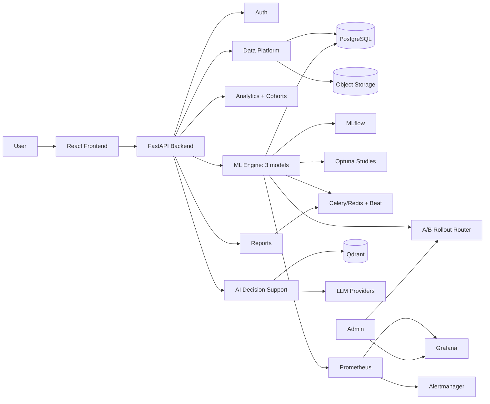

# Application Flow Document (APP_FLOW)

**Version:** v3.0
**Status:** Active
**Related:** `01_PRD.md`, `02_TRD.md`, `00_VISION_ML_PLATFORM.md`, `docs/architecture/adr/`

---

# 1. Purpose

Describes user-facing (and MLOps-operator-facing) flows for the full
platform. v1.0 covered only Auth + RAG Chat; v2.0 added Data Platform,
Analytics, ML Engine, and Reporting flows; this version adds the flows
introduced by the full production ML platform scope
(`00_VISION_ML_PLATFORM.md`): a second and third model, continuous
training, A/B rollout, cohort analysis, and active learning.

---

# 2. Scope

Covers: onboarding/auth, data upload & versioning, analytics dashboard
interaction (including cohort analysis), ML training/prediction/explanation
across all three models, continuous training, A/B rollout governance,
active learning feedback capture, AI Decision Support chat (7-stage
retrieval), and report generation/export.

---

# 3. User Roles

- **Standard User** — uploads data, views analytics/cohorts, runs
  predictions, uses AI chat, generates reports.
- **Admin** — user management, model version management, audit log access,
  **and now**: model monitoring dashboard access, A/B rollout review
  (approve/hold a promotion the auto-gate flagged), retraining job status.
  Per the project's report-only autonomy stance, the platform surfaces
  rollout/retraining decisions for Admin review rather than fully
  auto-acting where the gate is ambiguous (see §12).

---

# 4. High-Level User Journey

1. Register / log in.
2. Upload a dataset → validated → versioned.
3. Explore it on the Analytics Dashboard, including cohort filters.
4. Train or select a model (risk, treatment outcome) → run predictions →
   view SHAP explanation.
5. Ask AI Decision Support natural-language questions about the data, a
   prediction, or medical literature (now via the 7-stage retrieval
   pipeline).
6. (Background, ongoing) Models retrain on schedule or trigger; candidates
   roll out gradually and get promoted only after passing the statistical +
   fairness gate.
7. Export findings as a PDF/CSV/executive report, including a model
   monitoring summary if relevant.

---

# 5. Flow: Authentication & Onboarding

**Objective:** Secure entry into the platform.

1. User registers (email + password) → bcrypt hash stored.
2. User logs in → JWT issued.
3. JWT attached to all subsequent requests; role-based authorization applied per endpoint.

**Edge cases:** invalid credentials, expired token refresh, duplicate registration email.

---

# 6. Flow: Patient Data Platform

**Objective:** Get a clean, versioned dataset — and, where relevant,
patient/medical records — into the system.

1. User uploads a CSV (or a medical document for OCR/structured extraction).
2. Backend validates schema via pandera (ADR-014) and flags row-level issues.
3. User reviews validation results; triggers cleaning if needed.
4. A new immutable `dataset_version` is created for the cleaned result (ADR-009).
5. Dataset becomes selectable across Analytics, ML Engine, and AI Decision Support modules.
6. For patient records: OCR'd/structured data (medications, diagnoses, lab
   values) is attached to the patient's timeline (`10_PATIENT_MANAGEMENT.md`).

**Edge cases:** malformed CSV, schema mismatch against an existing dataset,
very large file requiring background processing rather than inline
validation, OCR producing low-confidence extraction requiring manual review.

**Compliance note:** every upload and record access is logged to
`audit_logs`; de-identification is never assumed (per workflow rules), and
MIMIC-III-sourced data (ADR-018) never appears in a user-facing upload flow
— it enters only through the private training pipeline (§10).

---

# 7. Flow: Clinical Analytics Dashboard

**Objective:** Let users explore an active dataset visually.

1. User selects an active dataset (and version).
2. Dashboard renders prevalence, risk distribution, demographic, and time-series charts (Recharts).
3. User configures/filters KPI widgets.

**Edge cases:** dataset too small for meaningful demographic breakdowns; missing columns required for a given chart (graceful fallback, not a hard error).

---

# 8. Flow: Cohort Analysis & Disease Pattern Mining (new)

**Objective:** Let a Clinical Researcher compare patient groups and surface patterns, not just view one dataset's aggregate charts.

1. User defines a cohort filter (condition, treatment, demographic range, outcome).
2. Dashboard renders the filtered cohort's charts alongside a comparison cohort (e.g. "treatment A vs. treatment B" or "cohort vs. whole dataset").
3. User can request disease pattern mining: unsupervised clustering over the active dataset/cohort, surfaced as grouped visual clusters with representative feature summaries per cluster.
4. User can request association discovery (which symptom/feature combinations co-occur with which diagnoses) as a ranked list, not a raw statistical dump.

**Edge cases:** cohort too small for statistically meaningful comparison (flagged, not silently charted as if it were meaningful); clustering on a dataset with too few rows to form stable clusters.

---

# 9. Flow: ML Engine — Risk Assessment (Model 1)

**Objective:** Produce an explainable, fairness-checked risk-stratification prediction.

1. User selects a dataset version and triggers training (Celery background job, ADR-010), optionally with an Optuna hyperparameter search (ADR-015) instead of fixed hyperparameters.
2. MLflow logs the run (and each Optuna trial as a nested run); user compares runs by ROC-AUC/precision/recall/calibration.
3. Best trial registers to `Staging`; promotion to `Production` follows the A/B rollout gate (§12), not a direct manual promotion.
4. User (or the system, per-patient) requests a prediction → served synchronously from the `Production` model.
5. SHAP `TreeExplainer` computes and persists the local explanation (top risk factors) alongside the prediction (ADR-011).
6. User views the prediction with its SHAP explanation in the UI.

**Edge cases:** training job failure/timeout, no `Production` model yet registered (falls back to the best `Staging` candidate with a clear "not yet promoted" label, never silently), SHAP computation exceeding latency budget for very wide feature sets (mitigated by async global summaries).

---

# 10. Flow: ML Engine — Treatment Outcome Prediction (Model 2, new)

**Objective:** Help a clinician choose between treatment options for a specific patient.

1. User selects a patient, a diagnosis, and one or more candidate treatments.
2. Backend retrieves the patient's profile and similar historical cases (from the training data — MIMIC-III-derived model where credentialed access has landed, ADR-018; synthetic-data-trained model otherwise).
3. The ensemble model (Random Forest + Gradient Boosting) returns, per candidate treatment: success probability, expected recovery time, a confidence interval, possible side effects, and a ranked list of alternatives.
4. SHAP explanation accompanies the prediction, consistent with Model 1's explainability requirement.
5. User compares candidate treatments side by side in the UI.

**Edge cases:** patient profile too sparse for a confident prediction (surfaced as a wide confidence interval, not a falsely precise number); a requested treatment combination absent from training data (explicit "insufficient data" response, not an extrapolated guess presented as confident).

---

# 11. Flow: Model Retraining — Continuous Training & Optuna (new)

**Objective:** Keep models current without requiring a human to remember to retrain them.

1. A Celery beat scheduled job checks, weekly, whether retraining is due, and separately whether the drift-monitoring job (§13 of `02_TRD.md`) has flagged data or performance drift.
2. If due (schedule) or triggered (drift/degradation), the standard training+Optuna job (§9's mechanics) runs against the current `Production` dataset version.
3. Resulting candidate registers to `Staging` in MLflow.
4. Admin is notified (Slack/email, per ADR-016) that a new candidate is ready; the candidate then enters the A/B rollout flow (§12) — retraining never auto-promotes straight to `Production`.

**Edge cases:** Celery beat itself silently stopping (monitored per ADR-016, not assumed healthy); a retraining run producing a worse model than the incumbent (the A/B gate in §12 is exactly what prevents this from mattering — a worse candidate simply never gets promoted).

---

# 12. Flow: A/B Testing & Model Rollout Governance (new)

**Objective:** Ensure no model version reaches all users without evidence it's actually better — and not less fair.

1. A `Staging` candidate is assigned a `rollout_percentage` (starts small, e.g. 5%) and begins receiving that fraction of inference traffic, routed deterministically per patient/session (ADR-019).
2. Over a minimum 7-day window, the rollout job aggregates the primary metric and fairness metrics (ADR-016) for both candidate and incumbent cohorts.
3. A statistical significance test runs (two-proportion z-test / bootstrap CI).
4. **Auto-promotion** occurs only if all three hold: primary metric better by >2%, result significant (p<0.05), no fairness metric regressed past the alert threshold.
5. If any condition fails, the candidate is **not** promoted — this is surfaced to the Admin as a decision point (report-only autonomy: the system proposes, a human can review and decide whether to extend the rollout window, adjust, or archive the candidate), not silently retried forever.
6. On promotion, the previous `Production` version moves to `Archived` (never deleted) — rollback is a stage change.

**Edge cases:** insufficient traffic volume to reach statistical significance within the window (extend the window rather than force a decision on underpowered data); a fairness regression on a subgroup too small to be individually significant (flagged as "insufficient data to confirm fairness," not silently passed).

---

# 13. Flow: Active Learning — Feedback for Model Improvement (new)

**Objective:** Capture ground-truth outcomes and expert corrections so future training runs have better labels, not just more raw data.

1. When a real (or simulated, per §11 of `00_VISION_ML_PLATFORM.md`) outcome becomes available for a prior prediction (e.g. the actual treatment outcome, or a clinician's correction to a risk assessment), it's recorded against the original `PredictionLog` entry rather than as a disconnected new row.
2. Cases where the model's confidence was low, or where a clinician explicitly disagreed with a prediction, are flagged for prioritized inclusion in the next labeled `annotated_data` set.
3. The next scheduled or triggered retraining run (§11) incorporates this feedback as part of its training data, closing the loop between production predictions and future model quality.

**Edge cases:** conflicting feedback from multiple reviewers on the same prediction (resolved by a defined tie-break rule, not silently averaged); feedback volume too low to meaningfully influence retraining (logged as insufficient, not force-fit into the training set).

---

# 14. Flow: AI Decision Support (RAG Chat)

**Objective:** Grounded natural-language interaction, now backed by the 7-stage advanced retrieval pipeline (ADR-017) rather than single-stage dense search.

1. User asks a question (about the dataset, a specific prediction, or general medical literature).
2. Request routes through the existing multi-provider LLM abstraction (never a hardcoded provider).
3. For literature questions: the 7-stage pipeline runs — dense (ColBERT) + sparse (BM25) retrieval in parallel → metadata filtering → Reciprocal Rank Fusion → cross-encoder re-ranking → citation graph traversal → temporal decay — then citation-backed synthesis.
4. For "explain this prediction": stored SHAP values are pulled and passed as grounding context — the LLM narrates existing values, it does not generate an explanation independently.
5. For patient summaries: relevant dataset rows + prediction history are summarized.
6. Response streams to the UI with citations/sources where applicable.

**Edge cases:** low retrieval-confidence answers (surface uncertainty rather than fabricating), prediction-explanation requested for a patient with no stored prediction yet, retrieval pipeline latency exceeding budget under the full 7-stage path (degrade gracefully — e.g. skip citation graph traversal — rather than time out silently; tracked as an open risk in `02_TRD.md` §19).

---

# 15. Flow: Reporting

**Objective:** Turn dashboard/prediction/analytics/monitoring output into a shareable artifact.

1. User requests a PDF report, CSV export, executive dashboard, clinical summary, or model monitoring/fairness summary.
2. Small exports render synchronously; large ones (full-cohort PDF, full dataset export) run as a Celery job (ADR-012) with a polling status endpoint.
3. User downloads the finished file.

**Edge cases:** report requested while underlying dataset/model is mid-retraining (should reference a specific version, not "whatever is live now"), very large cohort exports requiring pagination/streaming, monitoring summary requested for a model with insufficient rollout data yet (report the gap explicitly rather than fabricating a summary).

---

# 16. System Interaction Overview

---

## Document Information

**Version History:**
- v1.0 — Auth + RAG Chat flows only (superseded)
- v2.0 — Adds Data Platform, Analytics, ML Engine, and Reporting flows (superseded)
- v3.0 — Adds cohort analysis, Model 2 (treatment outcome), continuous
  training/Optuna, A/B rollout governance, active learning, and the
  7-stage advanced RAG flow (current)

## End of Document
