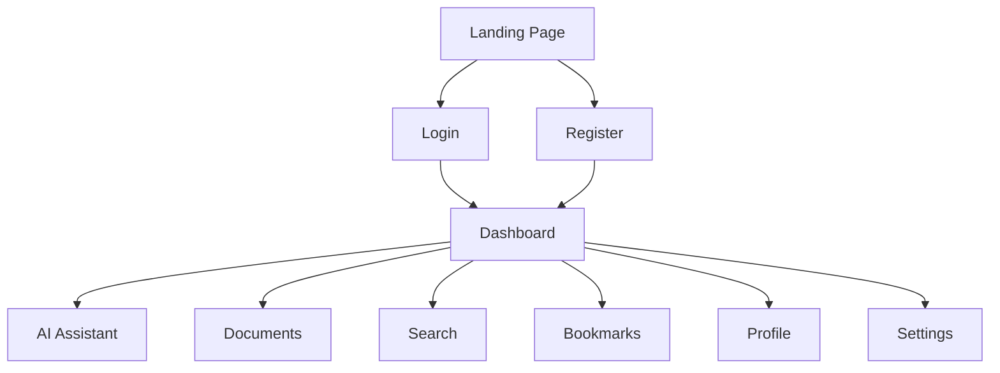

# AI Product Design & User Experience

| Field | Value |
|--------|-------|
| **Project** | MedIntel AI |
| **Document ID** | PD-001 |
| **Version** | v1.0 |
| **Status** | Frozen |
| **Owner** | Subhranshu Panda |
| **Repository** | medintel-ai |
| **Last Updated** | July 2026 |

---

# 1. Purpose

This document defines the product design philosophy and user experience principles of MedIntel AI.

The goal is to create an intuitive AI-powered platform that enables users to retrieve trustworthy medical knowledge through a clean, modern, and explainable interface.

This document complements the Product Requirements Document (PRD), Technical Requirements Document (TRD), and Application Flow documentation.

---

# 2. Product Design Philosophy

MedIntel AI is designed around three core principles.

| Principle | Description |
|------------|-------------|
| **Clarity** | Simple interfaces with minimal cognitive load. |
| **Explainability** | Every AI response is supported by citations. |
| **Efficiency** | Users should reach relevant information in as few interactions as possible. |

---

# 3. User Experience Goals

The application is designed to help users:

- Ask questions naturally.
- Discover trusted medical knowledge.
- Understand AI-generated answers through citations.
- Continue conversations without losing context.
- Navigate the application with minimal effort.

---

# 4. Product Navigation



---

# 5. Application Layout

The application follows a dashboard-first design.

```text
┌────────────────────────────────────────────────────────────┐
│                        Top Navigation                      │
├──────────────┬──────────────────────────────┬──────────────┤
│              │                              │              │
│              │                              │              │
│   Sidebar    │        Main Workspace        │  AI Sources  │
│              │                              │              │
│              │                              │              │
├──────────────┴──────────────────────────────┴──────────────┤
│                     Chat Input Area                        │
└────────────────────────────────────────────────────────────┘
```

---

# 6. Core Screens

| Screen | Primary Purpose |
|---------|-----------------|
| Landing Page | Product introduction and authentication |
| Dashboard | Central navigation hub |
| AI Assistant | Conversational medical intelligence |
| Search | Semantic search across medical knowledge |
| Documents | Upload and manage medical literature |
| Bookmarks | Save important conversations |
| Profile | User preferences and account settings |

---

# 7. AI Interaction Experience

The AI assistant is designed around a transparent retrieval workflow.


Each response should:

- Stream progressively.
- Display supporting citations.
- Encourage follow-up exploration.
- Preserve conversation context.

---

# 8. Design Principles

| Principle | Implementation |
|------------|----------------|
| Simplicity | Minimal visual clutter |
| Consistency | Shared design components |
| Accessibility | Keyboard-first navigation |
| Explainability | Citation-backed AI responses |
| Responsiveness | Desktop-first with mobile support |
| Feedback | Clear loading and status indicators |

---

# 9. Component Library

| Component | Usage |
|------------|-------|
| Button | Primary user actions |
| Card | Medical documents and summaries |
| Chat Bubble | AI conversations |
| Table | Search results |
| Badge | Citation labels |
| Modal | Confirmation dialogs |
| Toast | Success and error notifications |
| Loader | AI processing indicators |

---

# 10. Accessibility

The interface follows accessibility best practices.

| Feature | Status |
|----------|--------|
| Responsive Layout | ✓ |
| Keyboard Navigation | ✓ |
| Semantic HTML | ✓ |
| Color Contrast | ✓ |
| Loading Indicators | ✓ |
| Screen Reader Support | Planned |

---

# 11. Design System

| Category | Technology |
|----------|------------|
| Frontend | React + TypeScript |
| Styling | Tailwind CSS |
| UI Components | shadcn/ui |
| Icons | Lucide Icons |
| Charts | Recharts |
| Animations | Framer Motion |

---

# 12. Future Improvements

Future iterations may include:

- Voice-based AI interaction
- Personalized dashboards
- Dark/Light themes
- Multi-language support
- Advanced document annotation
- Collaborative research workspaces

---

# Product Design Summary

MedIntel AI prioritizes clarity, explainability, and efficiency to create a trustworthy AI experience for medical education and research.

The product combines modern interface design with Retrieval-Augmented Generation (RAG) to deliver transparent, citation-backed AI responses while maintaining a clean and intuitive user experience.

---