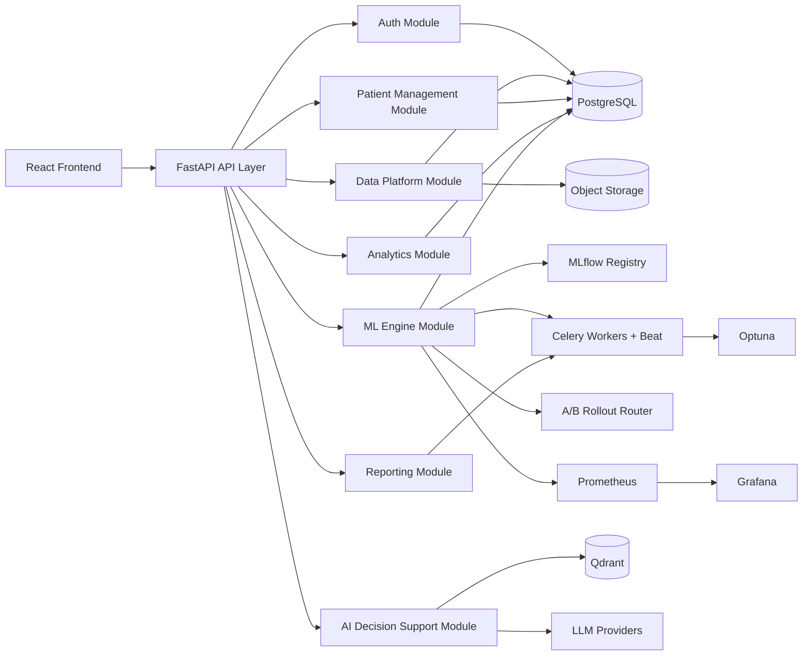
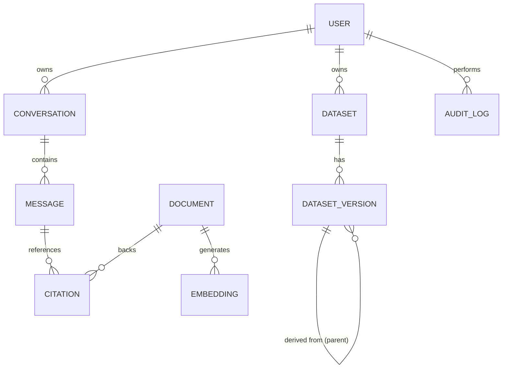
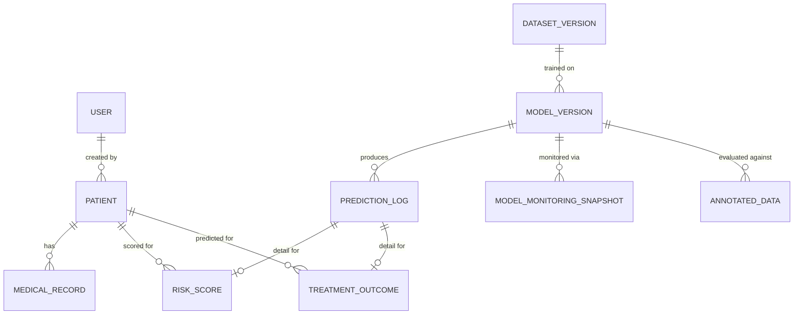
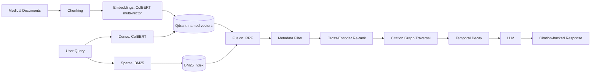
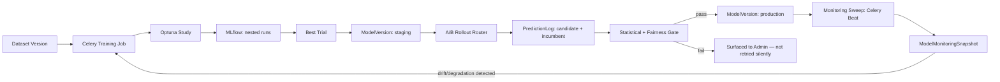
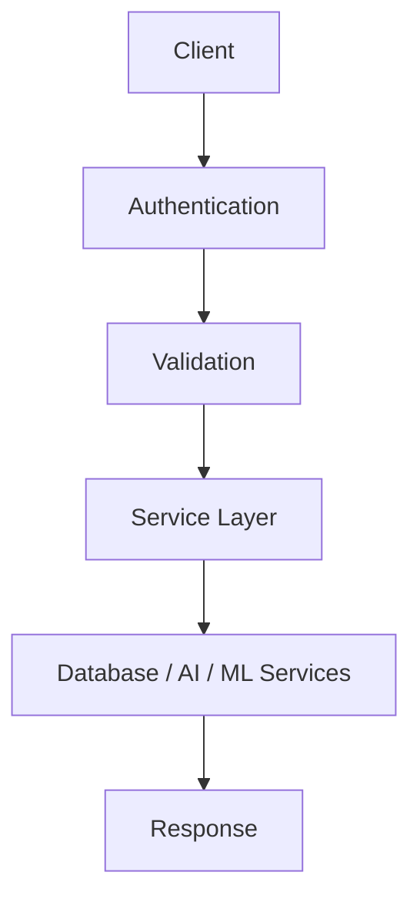
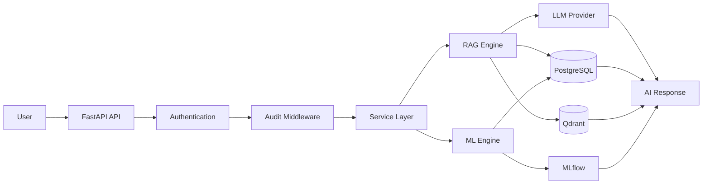

# Backend Schema & Service Architecture

| Field | Value |
|--------|-------|
| **Project** | MedIntel AI |
| **Document ID** | BS-001 |
| **Version** | v2.0 |
| **Status** | Active |
| **Owner** | Subhranshu Panda |
| **Repository** | medintel-ai |
| **Last Updated** | July 2026 |
| **Related** | `02_TRD.md`, `00_VISION_ML_PLATFORM.md`, `docs/architecture/adr/` |

---

# 1. Purpose

This document provides a high-level overview of the backend architecture,
data model, and service organization of MedIntel AI. **v1.0 of this
document was marked "Frozen" while still describing only the original
RAG-chatbot scope** — it was never updated across Sprint 1–2 (auth/RBAC,
dataset platform, audit logging) or the five-pillar expansion, and had
drifted well behind the actual codebase. This version corrects that: §4
documents what is actually implemented today (verified against
`backend/app/models/`), and §5 specifies the new entities required for the
full production ML platform scope (`00_VISION_ML_PLATFORM.md`).

The backend is a **modular monolith** (ADR-008) that separates
authentication, data platform, ML engine (training/serving/monitoring/
rollout), AI orchestration (RAG), reporting, and patient/document
processing into distinct modules within one deployable service — not
separate microservices.

---

# 2. Backend Architecture Overview

The backend follows a modular service architecture where each module has a
single responsibility (API layer → Service layer → Repository layer →
Database layer, ADR-013), improving maintainability, scalability, and
independent evolution of each pillar.

---

# 3. Backend Modules

| Module | Responsibility |
|----------|----------------|
| Auth | User accounts, JWT authentication, role-based authorization (`clinician`/`analyst`/`admin`) |
| Data Platform | Dataset upload, versioning, pandera validation, immutable object storage (ADR-009, ADR-014) |
| Patient Management | Patient records, medical documents, OCR/structured extraction, patient timeline (new) |
| Analytics | Cohort filters, prevalence/risk/demographic/time-series views, disease pattern mining |
| ML Engine | Training orchestration, MLflow registry, SHAP explanation, Optuna HPO, drift/fairness monitoring, A/B rollout governance (ADR-010, ADR-011, ADR-015, ADR-016, ADR-019) |
| AI Decision Support | Conversation lifecycle, message management, 7-stage retrieval pipeline, citation-backed generation (ADR-017) |
| Reporting | PDF/CSV/executive/clinical/monitoring-summary export generation (ADR-012) |

---

# 4. Data Model — Currently Implemented

This section reflects `backend/app/models/` as it exists today (verified,
not aspirational). All tables use a UUID primary key and DB-maintained
`created_at`/`updated_at` timestamps (`UUIDMixin`/`TimestampMixin`,
`app/models/base.py`) — UUIDs specifically so record counts and patient
identifiers are never enumerable or guessable.

## Core Entities (implemented)

| Entity | Purpose | Key fields |
|---|---|---|
| `User` | Authentication and RBAC | `email` (unique), `hashed_password` (bcrypt), `role` (`clinician`/`analyst`/`admin`), `is_active` |
| `Conversation` | An AI chat session owned by a user | `user_id`, `title` |
| `Message` | A single turn (user/assistant/system) within a conversation | `conversation_id`, `role`, `content` |
| `Document` | A medical knowledge source chunked for RAG | `title`, `source`, `content` |
| `Embedding` | Metadata for a document chunk vector (the vector itself lives in Qdrant, ADR-004) | `document_id`, `chunk_index`, `text_chunk`, `vector_id` |
| `Citation` | Source attribution linking a message to a document | `message_id`, `document_id`, `snippet`, `score` |
| `Dataset` | A logical, named clinical dataset owned by a user | `name`, `description`, `owner_id`, `deleted_at` (soft delete) |
| `DatasetVersion` | An immutable snapshot: one stored object + one metadata row (ADR-009) | `dataset_id`, `version_number`, `parent_version_id`, `origin`, `storage_uri`, `checksum`, `row_count`, `column_names`, `schema_hash`, `validation_status`, `validation_report` (JSONB, ADR-014), `transformation`, `created_by_id` |
| `AuditLog` | Append-only trail for every request against a patient-data-handling endpoint (successes **and** 401/403 rejections) | `actor_id`, `actor_role`, `action`, `resource_type`, `resource_id`, `path`, `status_code`, `client_ip`, `user_agent`, `detail` (JSONB) |

`AuditLog` is deliberately append-only by construction (nothing in the
codebase updates or deletes rows) and already covers the audit
requirements for the new entities in §5 without modification — every
endpoint touching `Patient`, `MedicalRecord`, `RiskScore`, or
`TreatmentOutcome` routes through the same `AuditLogMiddleware` (raw ASGI
middleware, not `BaseHTTPMiddleware` — see `.ai/memory/project-memory.md`
for why) that already covers `datasets`.

---

# 5. Data Model — New Entities (Full Platform Scope)

Full rationale for each: `00_VISION_ML_PLATFORM.md`; architectural
decisions behind the ML-specific tables: ADR-010, ADR-015, ADR-016,
ADR-018, ADR-019. All follow the same `UUIDMixin`/`TimestampMixin`
convention as §4 — no new persistence pattern is introduced.

## New Entities

| Entity | Purpose | Key fields |
|---|---|---|
| `Patient` | A (synthetic, or MIMIC-III-research-scoped) patient record — demographics and comorbidity summary, not raw clinical documents | `external_ref` (de-identified source id, e.g. MIMIC-III `subject_id` where applicable — never a real-world identifier), `date_of_birth_year` (year only, not full DOB, to reduce re-identification surface per GDPR-aware handling), `sex`, `comorbidities` (JSONB), `created_by_id` |
| `MedicalRecord` | An uploaded medical document (PDF/image) plus its OCR/structured extraction | `patient_id`, `storage_uri` (ADR-009-style immutable object), `document_type`, `ocr_text`, `extracted_data` (JSONB: medications, diagnoses, lab values), `extraction_confidence`, `reviewed_by_id` (nullable — set when a human confirms a low-confidence extraction) |
| `ModelVersion` | One trained, registered model — mirrors the MLflow registry locally so the API can query without round-tripping to MLflow per request | `model_name` (`risk_stratification` / `treatment_outcome` / `literature_ranker`), `mlflow_run_id`, `stage` (`staging`/`production`/`archived`), `dataset_version_id` (FK, ADR-009 traceability), `hyperparameters` (JSONB — the winning Optuna trial, ADR-015), `metrics` (JSONB), `trained_at`, `promoted_at` |
| `PredictionLog` | Every prediction made by any model, tagged with the serving `ModelVersion` — the record A/B rollout analysis (ADR-019) aggregates over | `model_version_id`, `patient_id` (nullable — not all predictions are patient-scoped), `rollout_cohort` (`candidate`/`incumbent`/none), `input_features` (JSONB), `output` (JSONB), `shap_values` (JSONB, ADR-011), `actual_outcome` (nullable — filled in later via active learning, `03_APP_FLOW.md` §13) |
| `RiskScore` | Model-1-specific prediction detail beyond the generic `PredictionLog` record | `prediction_log_id`, `patient_id`, `cardiac_risk`, `diabetes_risk`, `stroke_risk`, `cancer_risk` (each 0–100), `top_risk_factors` (JSONB, SHAP-derived) |
| `TreatmentOutcome` | Model-2-specific prediction detail | `prediction_log_id`, `patient_id`, `diagnosis`, `proposed_treatment`, `success_probability`, `expected_recovery_days`, `confidence_interval` (JSONB), `ranked_alternatives` (JSONB), `possible_side_effects` (JSONB) |
| `ModelMonitoringSnapshot` | One scheduled drift/fairness monitoring run's result (ADR-016) | `model_version_id`, `data_drift_score` (KS-test statistic per feature, JSONB), `model_drift_score` (Wasserstein distance), `fairness_metrics` (JSONB — equalized odds / demographic parity / predictive parity per protected attribute), `alert_triggered` (bool), `alert_reason` |
| `AnnotatedData` | Labelled data for training/evaluation — covers both prediction-model ground truth and retrieval relevance judgments (ADR-017's Model 3 evaluation) | `model_name`, `dataset_version_id` (nullable — retrieval judgments aren't tied to a tabular dataset version), `input_ref` (query text, or a row reference), `label` (JSONB), `annotator_id`, `annotation_source` (`clinician_review`/`active_learning`/`expert_panel`) |

**Naming reconciliation with `02_TRD.md` §14**: the TRD's early sketch used
generic `models`/`training_runs`/`predictions` table names; this section is
the authoritative, more specific naming (`ModelVersion`, `PredictionLog`)
now that the design has been worked through in detail — `02_TRD.md` should
be treated as pointing here for the final word on table names, not the
reverse.

---

# 6. AI Data Flow (RAG — 7-Stage Retrieval, ADR-017)

`Embedding.vector_id` (§4) now references a Qdrant **named vector** (one of
possibly several per chunk, for ColBERT's multi-vector representation) —
existing single-vector collections need a migration, not just an addition,
per ADR-017's Negative consequences.

---

# 7. ML Data Flow (Training, Monitoring, Rollout)

This is one pipeline end to end — manual, scheduled, and drift-triggered
training all enter at "A" the same way; there is no separate "automated"
code path that duplicates this logic (consistent with the Backend
Architecture principle in §1 of `02_TRD.md`).

---

# 8. API Layer

## API Responsibilities

| Layer | Responsibility |
|---------|---------------|
| Authentication | Identity verification, role extraction |
| Validation | Request validation (Pydantic v2), pandera for dataframe payloads |
| Service Layer | Business logic — one service per module (§3), no cross-module DB access |
| ML Layer | Training orchestration, registry queries, rollout routing, monitoring queries |
| AI Layer | RAG orchestration (7-stage retrieval) |
| Data Layer | Database operations (repository pattern, ADR-013) |
| Response Layer | Standardized API responses |

---

# 9. Security & Scalability

| Area | Implementation |
|------|----------------|
| Authentication | JWT-based, re-checked against DB role every request (JWT role claim is informational only — `.ai/memory/project-memory.md`) |
| Password Storage | bcrypt (direct, not passlib — `.ai/memory/project-memory.md`) |
| Authorization | Role-Based Access Control: `clinician` / `analyst` / `admin` |
| API Design | Stateless REST APIs |
| Containerization | Docker (backend, frontend, PostgreSQL, Qdrant, Redis, Celery worker+beat, MLflow, Prometheus, Grafana, Alertmanager — `02_TRD.md` §18) |
| Database | PostgreSQL |
| Vector Database | Qdrant (named vectors for ColBERT, ADR-017) |
| Sensitive Data Isolation | MIMIC-III data (ADR-018) lives only in private training infrastructure — never in the application database, the repository, or a public-facing deployment; `Patient`/`MedicalRecord` rows created from it are still subject to the same de-identification discipline as any other patient row |

---

# 10. Engineering Highlights

The backend architecture is designed to support a production-grade
healthcare ML platform through:

- Modular service architecture (ADR-008), extended — not replaced — by
  every new capability in this scope
- Retrieval-Augmented Generation with a real multi-stage retrieval
  pipeline, not single-stage similarity search (ADR-017)
- PostgreSQL + Qdrant hybrid persistence
- Explainable AI with citation tracking **and** SHAP-grounded predictions
  (ADR-011)
- A full model lifecycle: train → tune (Optuna) → register (MLflow) →
  gate (A/B + fairness) → monitor (Prometheus/Grafana) → retrain on
  drift — not just "train once, serve forever"
- Append-only audit logging covering every patient-data-handling endpoint,
  old and new
- Stateless REST APIs, container-ready deployment
- Separation of business logic, AI orchestration, and ML operations

---

# 11. Request Lifecycle

Audit middleware (§4, `AuditLog`) sits ahead of the service layer for every
request, not bolted on per-endpoint — this is why it was implemented as
raw ASGI middleware rather than `BaseHTTPMiddleware` (deadlock gotcha
recorded in `.ai/memory/project-memory.md`), and why it required no change
to cover the new entities in §5.

---

# 12. Migration & Implementation Notes

- New tables in §5 follow ADR-013's pattern: SQLAlchemy 2.0 `Mapped`
  models, Alembic autogenerate (`compare_type=True`), explicit downgrade
  handling for any new PostgreSQL `ENUM` types (`stage`, `document_type`,
  `annotation_source`, etc.) since autogenerate does not drop enums on
  downgrade automatically.
- `ModelVersion`, `PredictionLog`, `ModelMonitoringSnapshot`, and
  `AnnotatedData` are additive to the existing schema — no existing table
  in §4 needs a breaking change to support them.
- `Embedding.vector_id` moving to Qdrant named vectors (§6) **is** a
  migration of existing data, not purely additive — sequence this as its
  own tracked piece of work when ADR-017 is implemented, not folded
  silently into another migration.
- Implementation order should follow `01_PRD.md` §11's phased build order:
  `ModelVersion`/`PredictionLog` land with Phase 1–2 (they're needed for
  Model 1 + MLflow integration to mean anything at the API level);
  `RiskScore`/`TreatmentOutcome` land with Model 2 (Phase 2); `Patient`/
  `MedicalRecord` land with Phase 4 alongside `10_PATIENT_MANAGEMENT.md`.

---

# Backend Summary

The MedIntel AI backend combines modern software engineering principles
with AI-native and ML-native architecture to deliver a scalable, secure,
production-ready platform for Retrieval-Augmented Generation, explainable
multi-model clinical prediction, continuous training and monitoring, and
governed model rollout — not just a RAG chatbot with a database behind it.

---

## Document Information

**Version History:**
- v1.0 — RAG-chatbot-only schema, marked "Frozen" without ever being
  updated for Sprint 1–2 or the five-pillar scope (superseded; this was
  stale documentation drift, corrected in v2.0)
- v2.0 — Documents the actually-implemented schema (§4, verified against
  `backend/app/models/`) and specifies new entities for the full
  production ML platform scope (§5) (current)

## End of Document
