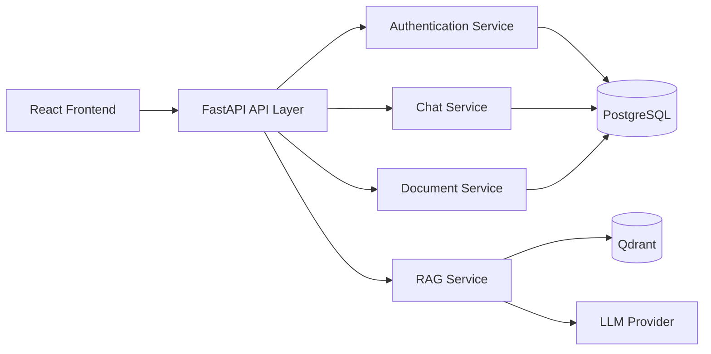
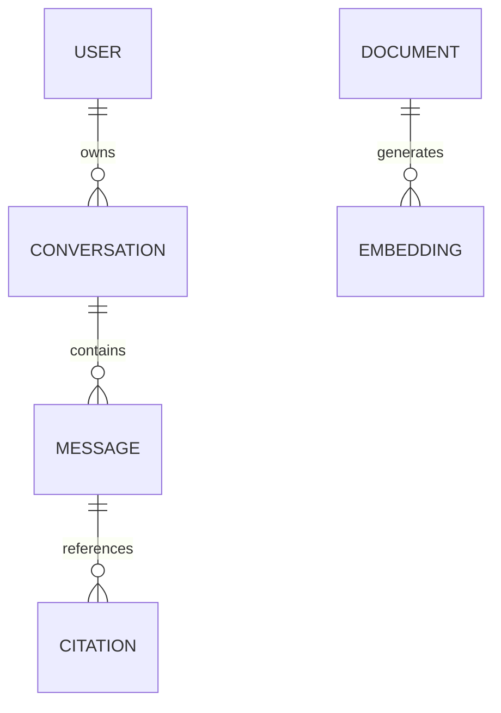
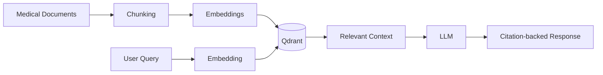
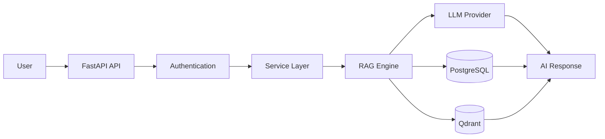

# Backend Schema & Service Architecture

| Field | Value |
|--------|-------|
| **Project** | MedIntel AI |
| **Document ID** | BS-001 |
| **Version** | v1.0 |
| **Status** | Frozen |
| **Owner** | Subhranshu Panda |
| **Repository** | medintel-ai |
| **Last Updated** | July 2026 |

---

# 1. Purpose

This document provides a high-level overview of the backend architecture, data model, and service organization of MedIntel AI.

The backend is designed around a modular architecture that separates authentication, AI orchestration, document processing, and data persistence while supporting scalable Retrieval-Augmented Generation (RAG) workflows.

---

# 2. Backend Architecture Overview


The backend follows a modular service architecture where each service has a single responsibility, improving maintainability, scalability, and independent evolution.
---

# 3. Backend Modules

| Module | Responsibility |
|----------|----------------|
| Authentication | User accounts, JWT authentication, authorization |
| Chat Service | Conversation lifecycle and message management |
| Document Service | Upload, validation, indexing, and metadata |
| RAG Service | Semantic retrieval and AI orchestration |
| Analytics | Monitor application usage, AI performance, and operational metrics |

---

# 4. Data Model



---

## Core Entities

| Entity | Purpose |
|---------|----------|
| User | Authentication and profile management |
| Conversation | Stores AI chat sessions |
| Message | User prompts and AI responses |
| Document | Medical knowledge sources |
| Embedding | Vector representations for semantic search |
| Citation | Source attribution for AI responses |

---

# 5. AI Data Flow



This pipeline illustrates how medical knowledge is transformed into searchable embeddings and combined with retrieved context to generate grounded AI responses.

---

# 6. API Layer

```mermaid
flowchart TD

Client

--> Authentication

--> Validation

--> Service Layer

--> Database / AI Services

--> Response
```

---

## API Responsibilities

| Layer | Responsibility |
|---------|---------------|
| Authentication | Identity verification |
| Validation | Request validation |
| Service Layer | Business logic |
| AI Layer | RAG orchestration |
| Data Layer | Database operations |
| Response Layer | Standardized API responses |

---

# 7. Security & Scalability

| Area | Implementation |
|------|----------------|
| Authentication | JWT-based |
| Password Storage | BCrypt hashing |
| Authorization | Role-Based Access Control (RBAC) |
| API Design | Stateless REST APIs |
| Containerization | Docker |
| Database | PostgreSQL |
| Vector Database | Qdrant |

---

# 8. Engineering Highlights

The backend architecture is designed to support modern AI applications through:

- Modular service architecture
- Retrieval-Augmented Generation (RAG)
- PostgreSQL + Qdrant hybrid persistence
- Explainable AI with citation tracking
- Stateless REST APIs
- Container-ready deployment
- Separation of business logic and AI orchestration

---

# 9. Request Lifecycle



# Backend Summary

The MedIntel AI backend combines modern software engineering principles with AI-native architecture to deliver a scalable, secure, and production-ready platform for Retrieval-Augmented Generation (RAG) and intelligent medical information retrieval.

---