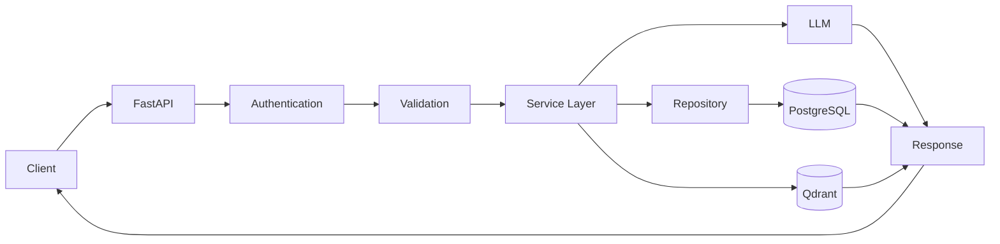

# API Lifecycle

```mermaid
flowchart LR

A[Client]

B[FastAPI]

C[Authentication]

D[Validation]

E[Service Layer]

F[Repository]

G[(PostgreSQL)]

H[(Qdrant)]

I[LLM]

J[Response]

A --> B

B --> C

C --> D

D --> E

E --> F

F --> G

E --> H

E --> I

I --> J

G --> J

H --> J

J --> A
```